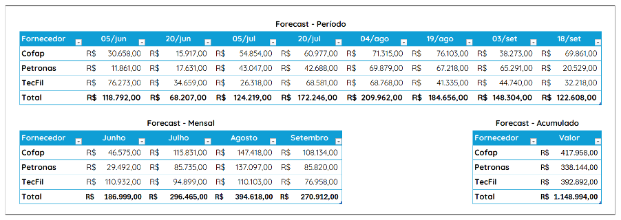
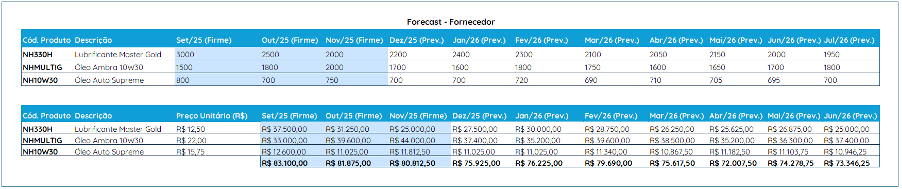

# MVP Forecast de compras

**Documento de requisitos para desenvolvimento – MVP Forecast de Compras**

----

## 1. Contexto e Objetivo do MVP

Em suma, a dor principal é a baixa visibilidade e o controle fragmentado sobre o processo de alçada de compras. O departamento precisa de uma solução que transforme o planejamento de compras de uma atividade reativa e manual para um processo proativo e baseado em dados. O MVP é o primeiro passo para resolver essa dor, oferecendo uma base funcional para que a equipe de compras possa começar a trabalhar de forma mais inteligente.

O objetivo deste MVP é desenvolver a funcionalidade de previsão de compras (Forecast) com as capacidades mínimas para validar a abordagem do cálculo. O foco inicial é implementar a fórmula básica e os parâmetros de entrada, permitindo que a área de compras visualize e exporte uma previsão de forma gerencial.

----

## 2. Funcionalidades para o MVP
### 2.1 Interface de parâmetros de entrada:
- Escolher entre relatório Gerencial ou Analítico;
- Em caso de relatório analítico, somente permitir selecionar um fornecedor, uma opção deve ser apresentada se deseja gerar com ou sem os valores de mercadoria;
- Formulário para seleção dos filtros: Grupo. Sub Grupo, Classe/Marca, Linha, Categoria e Fornecedor/Loja ou Todos (somente para relatório do gerencial).
- Campo para a “data de referência” (Fixada como data atual).
- Campo para inserção de dias do mês como pontos de compra futura;
- Campo para seleção de quantidades de meses futuros (Limitado a 12 Meses);

### 2.2 Cálculo do Forecast:
- Implementação da fórmula base:
. Previsão de Compras/dia/mês = (Consumo diário x Cobertura) – Estoque disponível – BO (aquisições).
- A “Cobertura” refere-se ao cadastro existente, Regras de cobertura ABC.
- A lógica de arredondamento por múltiplos de embalagem deve ser aplicada no final do processamento na data estipulada (Ex: Consolidação Central de compras).
- Não considerar produtos de curva G e H no forecast.
- Considerar apenas dias úteis.
- Considerar saldo do estoque, BO e recebimento de produtos que já foram marcados como substituídos. (Se o produto antigo estiver ok porém o novo estiver como cancelado, descartara projeção do produto).

### 2.3 Visualização dos Resultados:
- Apresentar os resultados do forecast em uma tela simples, seguindo o layout exemplificado no Tópico 5;
- Caso seja o relatório analítico, o sistema deve permitir que o usuário selecione os meses onde ficarão identificados como firme, sinalizando que já firmou com o fornecedor as quantidades apresentadas no relatório (limitado a 4 meses);
- Ao realizar a abertura do relatório o sistema deve identificar se já houveram meses marcados como firme em relatórios anteriores;

### 2.4 Exportação dos Dados:
- Funcionalidade para exportar os dados gerados em uma planilha.

----

# 3. Escopo do MVP (O que não será abordado nesta fase):
- **Interface Gráfica Avançada**: O MVP terá uma interface funcional, mas não otimizada visualmente.
- **Integração com Outros Sistemas**: A Prioridade é obter os dados da Central de Compras.
- **Personalização de parâmetros**: A personalização de parâmetros como a cobertura de estoque ou período de cálculo do consumo não será contemplada no espoco do MVP.

----

# 4. Simulação da Projeção de Compras Futuras
A projeção é uma simulação, dia a dia, do estoque futuro na filial/empresa. Para cada dia no horizonte de planejamento (por exemplo, os próximos 180 dias para uma projeção de 6 meses), vamos calcular o estoque projetado e verificar se um novo pedido de compra precisa ser listado.

**Componentes necessários para a simulação**
1.	**Consumo diário base (CDB)**: Consumo estatístico previamente calculado.
2.	**Estoque Atual (EA)**: Saldo disponível do estoque no momento do cálculo.
3.	**Compras em Trânsito (CT)**: Lista de pedidos já feitos (BO)
4.	**Tempo de Reposição (TR)**: O lead time do fornecedor em dias, em sua ausência, o TR será atribuído no dia seguinte ao evento da necessidade de compra do produto.
5.	**Lote de Compra (LC)**: A quantidade padrão a ser comprada (Embalagem mínima).

**Passo a Passo da Simulação de Compras Futuras**

Simular o fluxo de estoque para um produto específico. Esta lógica deve ser executada pela ferramenta para cada dia do horizonte de projeção (D+1,D+2,...,D+180).

**Variáveis da simulação**:
- **EstoqueProjetado(d)**: O nível de estoque estimado para o final do dia d.
- **PlanoDeCompras**: Uma lista dos pedidos que, na simulação, atingiram o ponto de compra.
**Início da Simulação (d=0, hoje)**:
- **EstoqueProjetado(0)** = Estoque Atual

Sequência da Simulação (para cada dia d de 1 até 180)
1.	Calcular o Recebimento Previsto para o Dia d:
1.1.	Verifique se há alguma compra em trânsito (da lista inicial CT) ou algum pedido do nosso PlanoDeCompras cuja data de chegada seja o dia d.
1.2.	**RecebimentoPrevisto(d)** = Soma das quantidades de todos os pedidos que chegam no dia d.
2.	Calcular o Estoque Projetado no Final do Dia d:
2.1.	**EstoqueProjetado(d)** = EstoqueProjetado(d-1) – ConsumoPrevisto(d) + RecebimentoPrevisto(d)
3.	Verificar a Necessidade de um Novo Pedido (O Ponto Crucial):
3.1.	Neste ponto, precisamos tomar a decisão de compra. A decisão não é baseada no estoque de hoje, mas no estoque projetado no futuro.
3.2.	Calcule a quantidade para ressuprimento.
3.3.	**Decisão**: Se o EstoqueProjetado(d) cair abaixo do estoque de cobertura, um novo pedido precisa ser feito imediatamente (no dia d) para evitar ruptura futura.
3.3.1.	 **Ação**: Adicionar um novo PlanoDeCompras.
3.3.2.	 **Fornecedor**: Identificação do fornecedor.
3.3.3.	 **Data do Pedido**: Dia d.
3.3.4.	 **Quantidade: Lote de Compra (LC)**.
3.3.5.	 **Data de Chegada Prevista**: Dia d + Tempo de Reposição (TR).
3.3.6.	 **Valor da Mercadoria**: Quantidade de ressuprimento multiplicado pelo custo unitário do produto.
3.3.7.	 Este novo pedido agora faz parte da simulação e seu recebimento será considerado no passo 2 um dia no futuro.

Fim da sequência.

Ao final da simulação de 180 dias, o PlanoDeCompras conterá uma lista de todas as ordens de compra que a empresa/filial precisará emitir nos próximos 6 meses, com a data de emissão e valor sugerido para cada uma.

O PlanoDeCompras deve aglutinar o valor das compras por fornecedor nos períodos informados, mês e acumulado.

# 5. Exemplo Visual da Projeçãõ

**Relatório Gerencial**

**Relatório Analitico**

Obs.: Para relatórios do tipo analítico a demonstração dos valores é opcional, ficando a critério do comprador gerar ou nãõ essa informaçãõ nos parâmetros iniciais (conforme tópico 2.1).

Para relatórios do tipo analítico, o sistema permitirá a seleção dos meses como firme (conforme tópico 2.3).

----

# 6. Próximos passos:
- Reunião com a área de Compras para obter as definições detalhadas dos pontos listados na seçãõ.
- Mapeamento das fontes de dados.
- Desenvolvimento e testes do MVP com base nos requisitos abordados.
- Apresentação do MVP para a área de compras e coleta de feedbacj para as priximas fases.