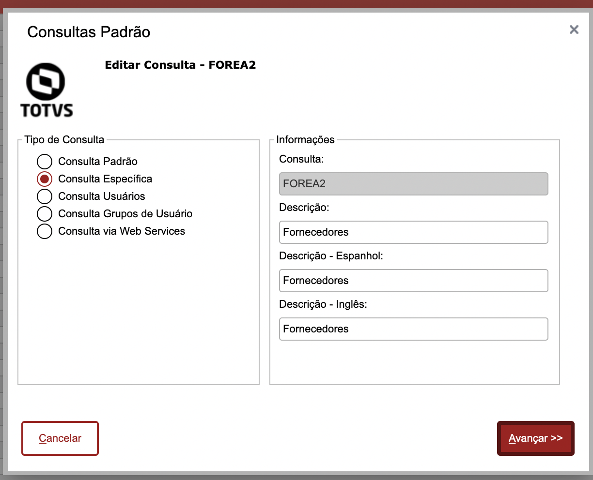
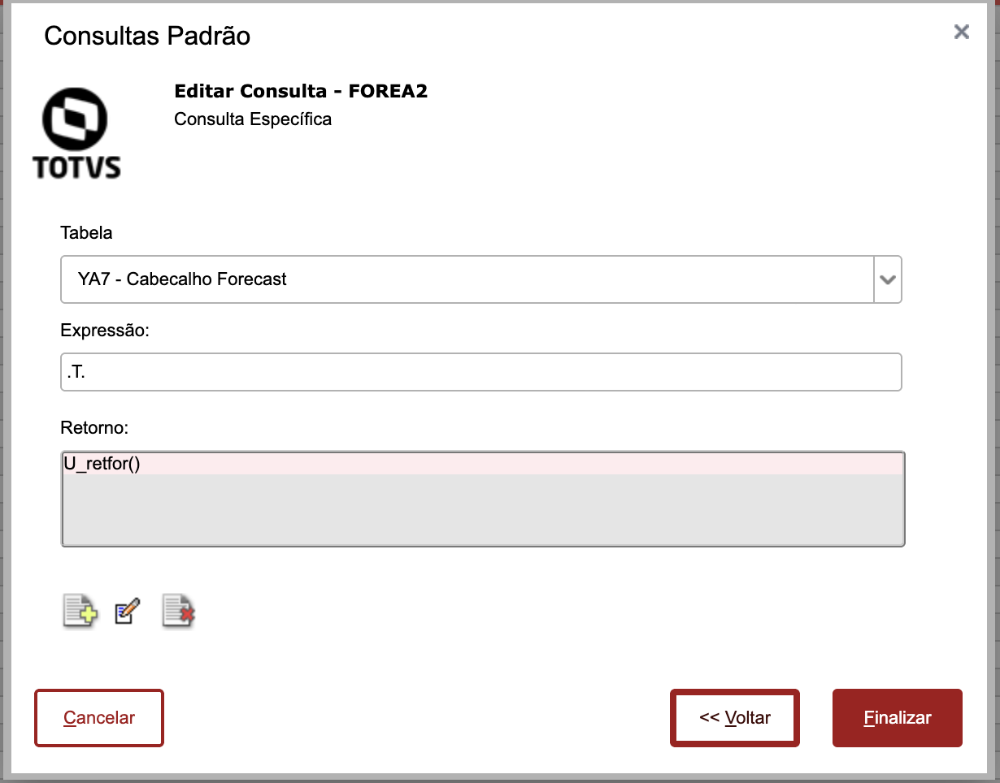
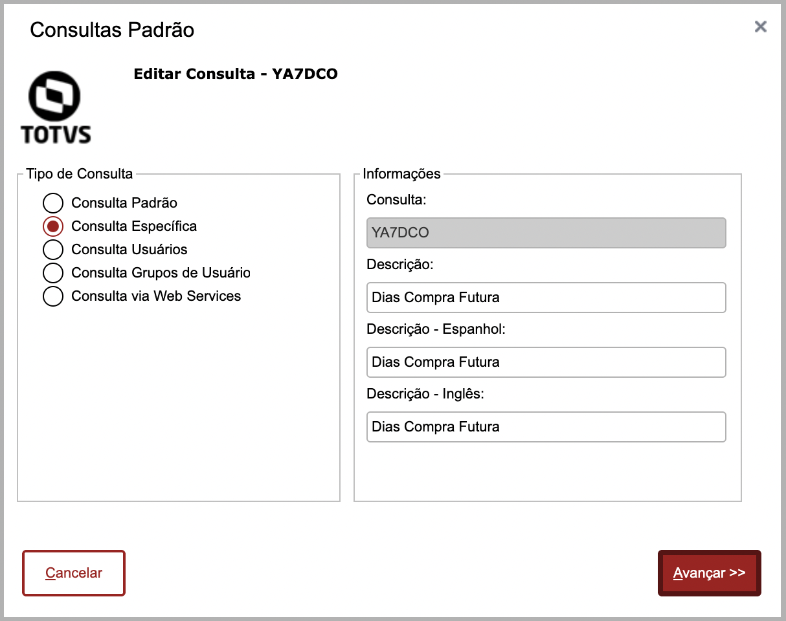
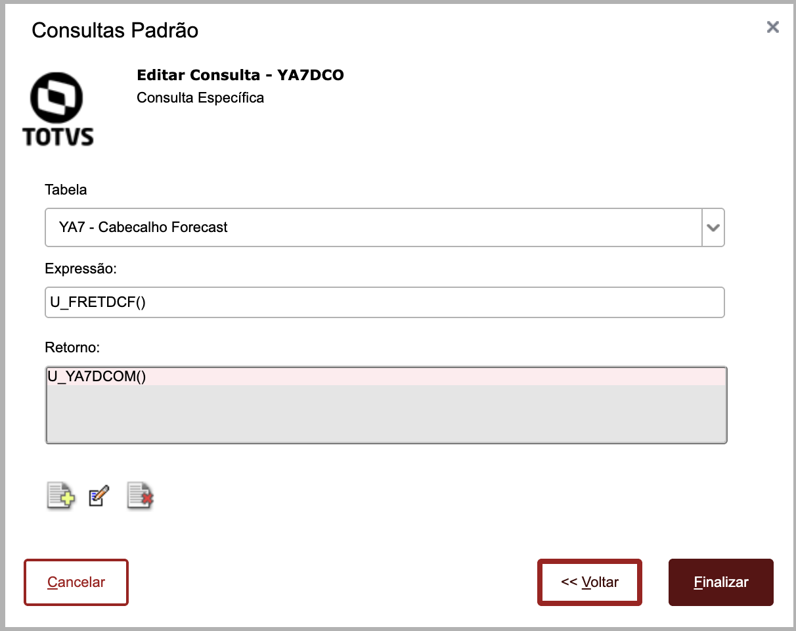

# Forecast - Customizações

----

## Fontes
-   [FORECAST.PRW](../../2-Fontes/forecast.md) - Processa dados e gera o forecast.
-   [RELFOREC.PRW](../../2-Fontes/relforec.md) - Apresenta o relatório do forecast gerado.
-   [FOREXFUN.PRW](../../2-Fontes/forexfun.md) - Funções complementares para o projeto forecast
-   [RETFOR.PRW](../../2-Fontes/retfor.md) - Retorna o fornecedor nos parâmetros de geração do forecast.

----

## Menu
- **U_FORECAST()**

----

## Tabelas
- **YA7** - Cabeçalho do FORECAST
- **YA8** - Itens do FORECAST

----

## Consulta Padrao
- **SBM** - Grupos 
- **PX0B** - Classes
- **FOREA2** - Retorno de Fornecedores (Novo)
- **YA7DCO** - Retorno dias para compras (Novo)

**FOREA2 - Retorno de Fornecedores (Novo)**

**YA7DCO - Retorno dias para compras (Novo)**

----

## Base de teste
- AG_DES

