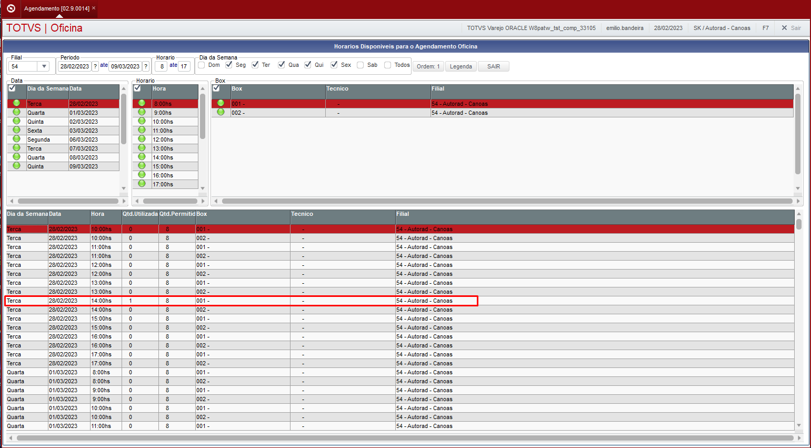
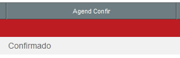
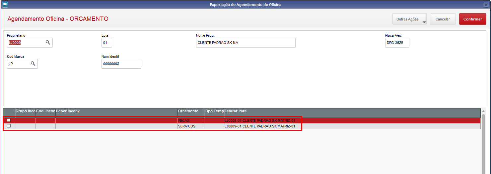
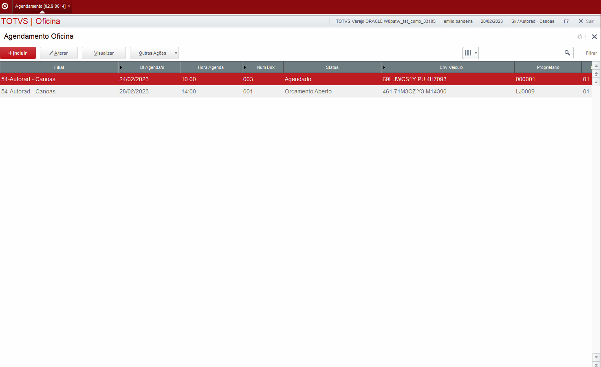

# Agendamento (SIGAOFI)

----

Menu: **Atualizações > Mov Oficina > Agendamento**

----

## Guia Passo a Passo

1. Incluir
2. Preencha o cabeçalho:
3. **Dt Agenda/o** = Data do agendamento
4. **Hora Agenda** = Horario do agendamento
5. **Num Box** = Numero do box de atendimento
6. **Status**
7. **Chv Veiculo** = Chave do veiculo/veiculo previamente cadastrado
8. Quando for apresentada a tela dados do veiculo, conforme os dados e clique em **"Salvar Alterações"**
9. No grid caso necessário, preencha o incoveniente, este grid **não é obrigatório** para concluir o agendamento.
10. Clique em **Salvar**

:::info
Para realizar o agendamento, é necessário que o cadastro do veículo já esteja feito e a escala dos produtivos esteja gerada.
:::

----

## Horarios Disponiveis para o Agendamento Oficina

A qualquer momento, dentro da rotina de agendamento, o produtivo pode visualizar os horarios disponíveis para um futuro agendamento de cliente.
Ao apertar a tecla **F7**, será exibida a seguinte tela:

Esta tela auxilia o produtivo que está realizando o agendamento, para que não ocorra conflitos entre agendamentos dentro do mesmo dia e horario.

----

## Confirma Agendamento

1. Na tela de **Agendamento oficina**, selecione o agendamento que deseja confirmar.
2. Clique em **Outras Ações**
3. Clique em **Confirma Agendam.**
4. Será apresentado a mensagem de confirmação de agendamento, clique em **Sim**
5. Será apresentado a mensagem para realização do **CheckList do Veiculo** clique em **Sim** ou **Não**

----

## CheckList de Veiculos

O checklist de veiculos pode ser acessado através da confirmação do agendamento ou pelo menu: **Atualizações > Mov Oficina > Check-list Veiculo**

Na tela da rotina, clique em **incluir**.

Preencha os campos obrigatórios:
* **Avaliação** - Numero sequencial definido pelo departamento de oficina.
* **Nivel Comb.** - Nivel do combustivel no momento da avaliação.
* **Grupo Gener.** - Código do Grupo generico que forma o componente principal do veiculo (Deve ser digitado manualmente, não segue critério).
* **Estepe**
* **Item Gener.** - Código do item que faz parte do grupo principal de componente do veiculo. Este é o componente do componente. (Deve ser digitado manualmente, não segue critério).
* **Possui CD**
* **Toca Fitas**
* **Frente Rem.**
* **Modulo Som**
* **Triangulo**
* **Possui DVD**
* **Rodas L.Leve**
* **Antena**
* **Possui Disq.**
* **Espelho Dir.**
* **Calota**
* **Farol Milha**
* **Tapete**
* **Acendedor C.**
* **Banco Couro**
* **Macaco**
* **Insulfim**
* **Alarme**
* **Corta-Comb.**
* **Vidro Verde**
* **Vidro Elet.**
* **Placa** - (Placa do veiculo que do check-list)

Ao terminar de preencher todos os campos necessários, clique em **Salvar**.

:::info
O campo **Numero OS** não é obrigatório, porém caso tenha uma OS aberta para o veículo, recomenda-se o preenchimento correto deste campo.
:::

----

## Confirma Presença do Cliente

A confirmação da presença do cliente pode ser acessada por dentro da rotina de agendamento.

1. Na rotina de agendamento, posicione no agendamento desejado.
2. Clique em **Outras Ações**.
3. Clique em **Confirma Presença**.
4. Informe os campos **Nome do Cliente** e **Placa do Veículo**
5. Clique em **Confirmar**

Após isso, o campo **Agend Confir** ficará com o conteúdo **Confirmado**

----

## Gerar orçamento pelo agendamento

Com o agendamento realizado, é possível gerar um orçamento.

1. Na rotina de agendamento, posicione no agendamento desejado.
2. Clique em **Outras Ações**
3. Clique em **Orcamento**.
4. O sistema exibirá a seguinte tela, selecione no grid o tipo de orçamento, (**Peças e/ou Serviços**)

5. Clique em **Outras Ações**.
6. Clique em **Altera TT e Faturar Para** (Esse processo deve ser realizado nas duas opções da GRID, mesmo que tenha selecionado uma unica opção).

7. Preencha a pergunta **TT Pecas?**.
8. Clique em **Confirmar**.

O agendamento será gerado e pode ser consultado na rotina de **Orc Por Fases**