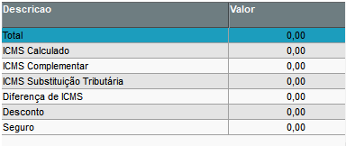
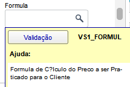
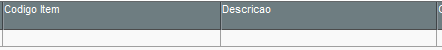
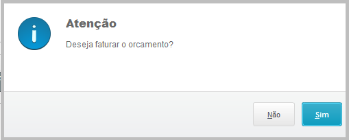
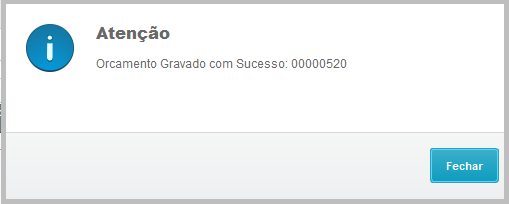
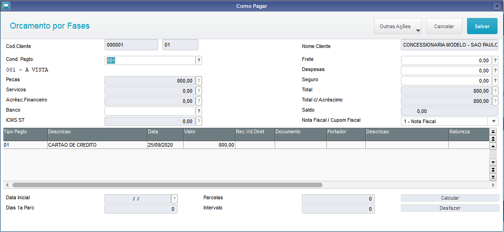
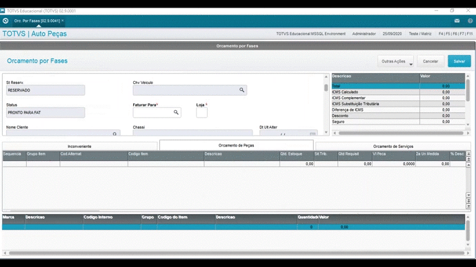
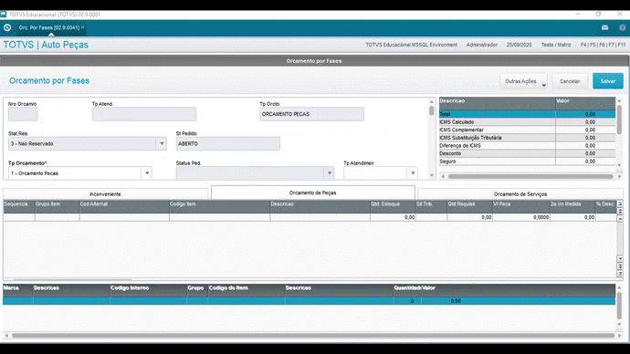

# Orçamento por fases (SIGAOFI)

----

## Guia passo a passo

### Orçamento de Peças
1. Pelo **Módulos Auto Peças/Oficinas**, acesse **Atualizações > Mov. Oficina > Orc. por Fases (OFIXA011)**
2. Clique em **Incluir** para incluir um orçamento.
3. **Tp. Orçamento** = Exempo 2 - Orçamento Oficina (após, na tela apresentada informar o tipo tempo peças e tipo tempo serviços, criados na rodina Tipos de Tempo)
4. **Chv. Veiculo** = Chassi do Veiculo (preencher de acordo com cadastro criado na rotina cadastro de veiculos) 
5. **Salvar alterações do veiculo**
6. **Faturar Para** = (preencher Cliente para faturar) 
7. **Vendedor** = (preencher com um vendedor)
8. **Cond. Pagto** = (preencher com a condição de pagamento) 
9. **Formula** = (preencher de acordo com cadastro criado na rotina Grupo de formulas)
10. **Transport** = (preencher com a Transportadoras)
11. **Cupom/Nota** = 1 - Nota fiscal 2 - Cupom Fiscal
12. **Tipo de Vd.** = 3 - Oficina
13. Na grid abaixo vamos selecionar **"Orçamento de Peças"** e preencher os campos:
14. **Grupo item** = (preencher de acordo com cadastro criado na rotina Grupo de itens)
15. **Codigo de item** = (preencher de acordo com cadastro criado na rotina Cadastro de Produto)
16. **Qtd. Estoque** = (Saldo inicial do estoque)
17. **Qtd. Requisit** = Quantidade do orçamento
18. **Tip operação** = (preencher de acordo com cadastro criado na Tabela do Sistema) 
19. **TES** = Tipo de Saída
20. **Depto. Garanti** = (preencher de acordo com cadastro criado na Tabela do Sistema)
21. **Depto. Intem** = (preencher de acordo com cadastro criado na Tabela do Sistema

### Orçamento Serviço
1. Pelo **Módulos Auto Peças/Oficinas**, acesse **Atualizações > Mov. Peças > Orc. por Fases (OFIXA011)**
2. Clique em **Incluir** para incluir um orçamento.
3. **Tp. Orçamento** = Exempo 2 - Orçamento Oficina (após, na tela apresentada informar o tipo tempo peças e tipo tempo serviços, criados na rodina Tipos de Tempo)
4. **Chv. Veiculo** = Chassi do Veiculo (preencher de acordo com o cadastro criado na rotina cadastro de veiculos) 
5. **Salvar alterações do veiculo**
6. **Faturar Para** = (preencher Cliente para faturar) 
7. **Vendedor** = (preencher com um vendedor)
8. **Cond. Pagto** = (preencher com a condição de pagamento) 
9. **Formula** = (preencher de acordo com o cadastro criado na rotina Grupo de formulas)
10. **Transport** = (preencher com a Transportadoras)
11. **Cupom/Nota** = 1 - Nota fiscal 2 - Cupom Fiscal
12. **Tipo de Vd.** = 3 - Oficina
13. Na grid abaixo vamos selecionar **"Orçamento de Peças"** e preencher os campos:
14. **Grupo Servic** = (preencher de acordo com cadastro criado na rotina Grupo de Serviços)
15. **Cod. Servico** = (preencher de acordo com cadastro criado na rotina Tabela de Serviço, Obs: o tmpo Fabrica e Vlr Hora precisam ser preenchidos pois seram carregados na grid Tempo padrao e Vlr hora, totalizando os valores)
16. **Depto. Garanti** = (preencher de acordo com o cadastro criado na Tabela do Sistema)
17. **Depto. Intem** = (preencher de acordo com o cadastro criado na Tabela do Sistema)
18. **Secao Of** = (preencher de acordo com cadastro criado na rotina Seções da Oficina)
----

## Impostos

Na parte superior direito é possível ver todos os impostos que são atualizados em tempo real ao incluir o produto.

----

## Fórmula (VS1_FORMUL)

A formula em todas as rotinas do DMS dá a possibilidade de incluir uma expressão em ADVPL para obter resultados de preenchimento de campos, no caso do atendimento do orçamento por fases ela serve para cálculo do valor do produto.

----

## Pesquisa produtos

A pesquisa de produto é realizada através da pesquisa pelo F3, ou por fragmento do código sem precisar entrar na tela de pesquisa.

4. Após preencher todos os campos necessários, clique em **Salvar**.
5. Será apresentada  a pergunta abaixo, clique em **Sim**.

6. Aparecerá a tela abaixo informando que o orçamento foi gravado com sucesso e o número do mesmo.

7. Será apresentada a tela Como pagar com as informações do orçamentos, conforme abaixo:

**Importante: Atente-se ao preenchimento do campo Nota Fiscal / Cupom Fiscal**

Caso seja preenchido com a opção **Nota Fiscal**, a finalização será direta e **realizado o faturamento e geração da nota fiscal**.

Caso seja salvo como **Cupom Fiscal** será gerado o **orçamento na rotina LOJA701 (Venda Assista/Venda Direta)** e a finalização ocorrerá por lá (obs: na rotina LOJA701 - Venda Assistida/Venda Direta).

Tabela VS1 - Cabeçalho

Tabela VS3 - Itens de Peça

Tabela VS4 - Serviço

:::info
[Documentação oficial](https://centraldeatendimento.totvs.com/hc/pt-br/articles/1500000156781-MP-DMS-Or%C3%A7amento-por-fases?source=search)
:::