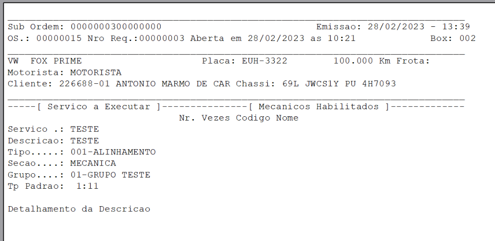
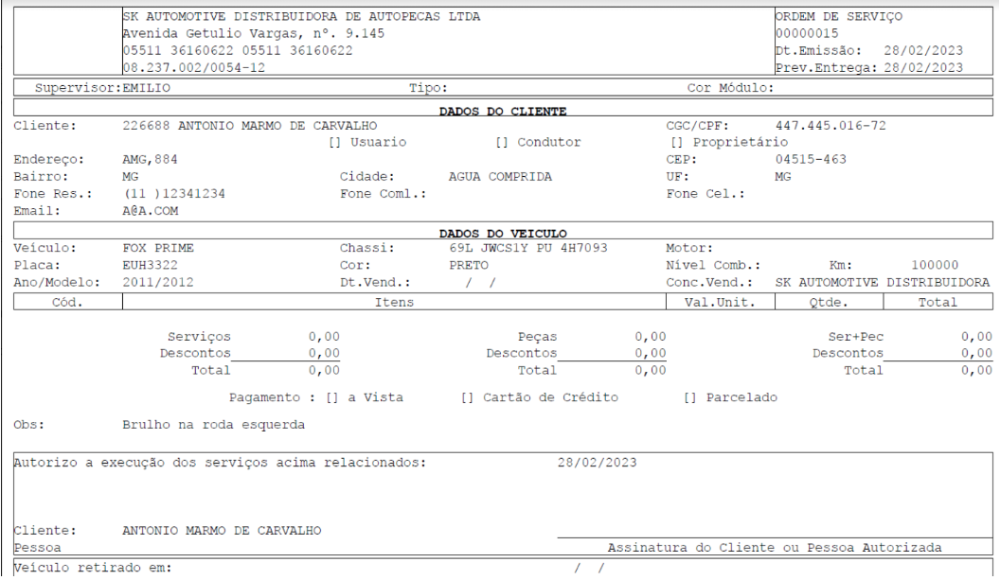
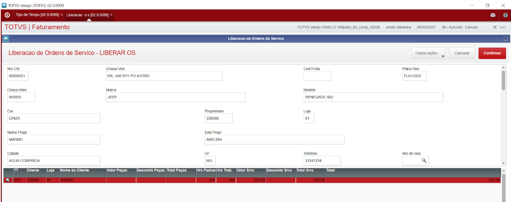
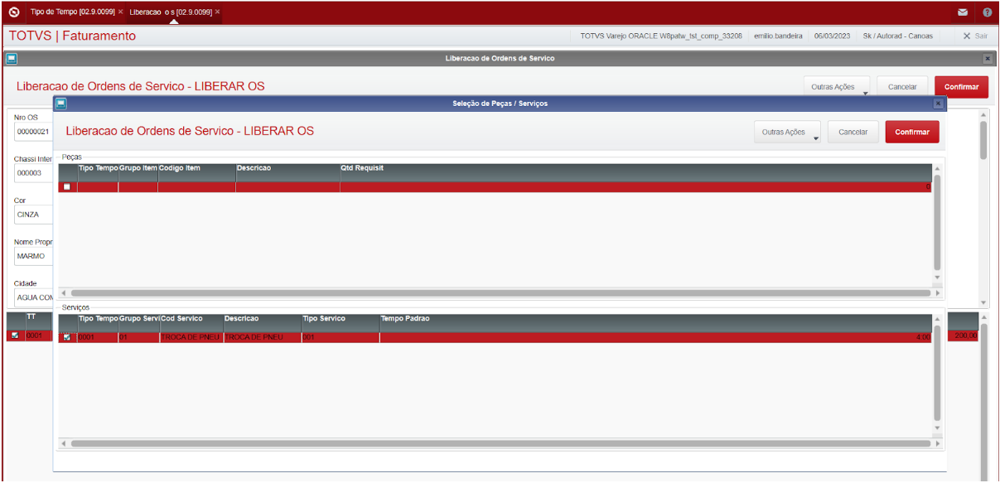
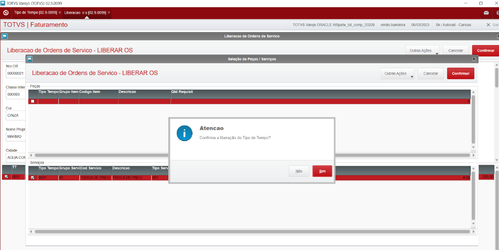
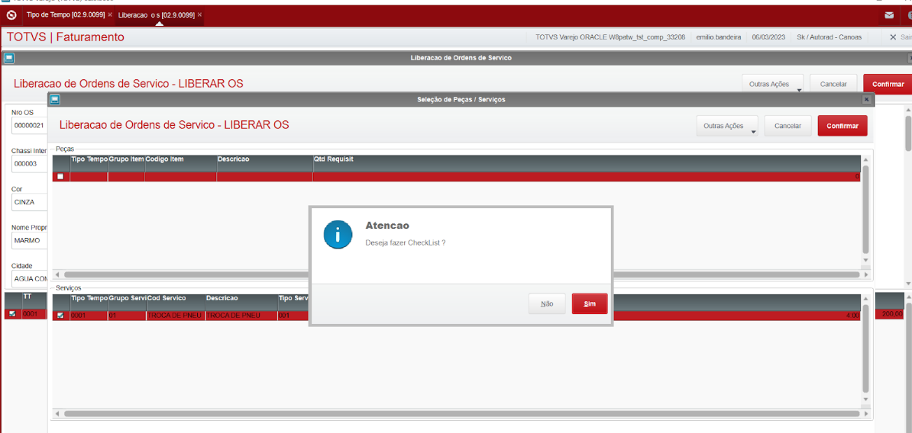
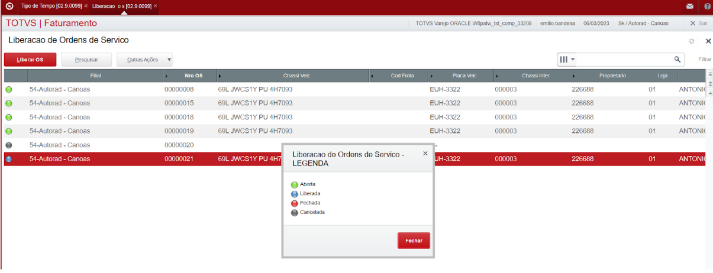

# Ordem de Serviço (SIGAOFI)

----

## Abertura de OS

Menu: **Atualização > Mov. Oficina > Abertura OS**

Acesse a rotina através do menu e clique em **+ Abrir O. S.**

Preencha os campos da OS:

1. **Chv. Veículo** = (chassi do veículo cadastrado na rotina cadastro de veículo)
2. Alterar dados do veículo = salvar alterações do veículo.
3. **Dt. Entrega** = (preencher com a data da O. S.)
4. **Motorista** = Informa-se aqui o código do motorista que está conduzindo o veículo.
5. **Número do Box** = Informa-se aqui em qual Box da oficina o veículo será atendido
6. **Cor do Prisma** = Informe qual é a cor do prisma genérico que o veículo será monitorado pelo sistema, caso haja interesse em tal controle.
7. **Quilometragem do Veículo (Horas OS Maq.)** = Informa-se aqui a quilometragem do veículo no momento da abertura da OS.
**Dt. Entrega** = Entrega da OS
8. **Consultor** = (preencher de acordo com o cadastrado criado na rotina tipo de produto)
9. **Hr OS Veic** = Informe aqui as horas de trilha do equipamento.

----

## Requisição de Serviço / Apontamento

Menu: **Atualizações > Mov. Oficina > Req Serviços/Apont**

O sistema apresenta uma tela browse contendo todas as ordens de serviço que estiverem abertas no sistema.

Selecione a **OS** em que deseja requisitar o Serviço e clique na opção **Requisitar**. Observe que o sistema apresenta duas telas, uma contendo dados da OS para consulta, e a outra é uma tela browse onde as informações deverão ser digitadas. Preencha os campos conforme indicado.

1. **Tipo de Tempo** = Informa-se aqui qual é o tipo de tempo para este serviço, lembrando que automaticamente com o tipo de tempo, vem a definição de quem será o cliente de faturamento para este serviço. Nesta informação também está configurado o valor da hora deste tipo de tempo, no que resultará o valor
do serviço.

2. **Faturar para / Loja** = Se os parâmetros no tipo de tempo permitirem, este campo admitirá alteração do cliente sugerido para o faturamento. Dependendo do Tipo de Tempo anteriormente escolhido, serão sugeridos automaticamente os possíveis clientes: **Proprietário do Veículo, Fabricante do Veículo, Cliente Padrão**.

3. **Grupo de Serviço** = Informa-se aqui o grupo de serviço do qual se deseja executar um serviço.
4. **Código do Serviço** = Informa-se aqui o código do serviço que se deseja executar. Refere-se ao reparo a ser realizado.

5. **Tipo de Serviço** = Informa-se aqui qual é o tipo de serviço que se deseja realizar. Esta informação indica a tabela de tempo que será utilizada para a cobrança deste serviço. Nele também está configurado o percentual de desconto permitido ao usuário conceder no momento do fechamento, sem ter a necessidade de pedir liberação de venda. Para um melhor entendimento, consultar o tópico Tipo de Serviço deste manual.

6. **Tempo Padrão** = Baseado nos parâmetros configurados no tipo de serviço, o sistema apresenta neste campo o tempo padrão para este serviço. Se no tipo de serviço estiver parametrizado o tempo informado, o sistema possibilitará ao usuário a digitação de um “tempo padrão” para este serviço. Este tempo informado será considerado o tempo padrão para este serviço nesta OS, toda vez em que ele for utilizado / consultado.

7. **Seção da Oficina** = Informa-se aqui qual é a seção da oficina que este serviço será realizado.

8. **Cor do Prisma** = Informe qual é a cor do prisma específico deste tipo de tempo/tipo de serviço/código do serviço cujo veículo será monitorado pelo sistema, caso haja interesse em tal controle.

9. **Emitir ?** = Informa-se aqui se será necessária a impressão da sub-ordem de serviço, com suas respectivas informações. Esta sub-ordem possibilitará ao mecânico realizar o apontamento eletrônico do serviço.

10. **Departamento de OS Interna** = Informa-se aqui qual é o departamento da concessionária que está sendo atribuído o serviço. Este campo somente será exigido quando assim estiver parametrizado no tipo de tempo.

11. **Departamento de Garantia** = Informa-se aqui qual é o departamento de atribuição do serviço. Este campo somente será exigido quando assim estiver parametrizado no tipo de tempo.

**Clique na pasta Apontamento Manual. Preencha os campos conforme indicado.**

**Produtivo** = Informa-se aqui qual é o produtivo que irá realizar a tarefa. Na consulta
F3 deste campo, aparecerão apenas aqueles que tem habilidade para a
realização desta tarefa.

**Data e Hora Inicial / Final** = Informa-se aqui qual é a data e hora inicial/final de execução da tarefa. O sistema critica a data e hora informada quando esta for menor do que a
data e hora de abertura da OS, também não será permitido ao usuário a
digitação de uma data e hora futura. Para os casos em que haja necessidade
de inclusão ou alteração de registros de serviço cuja data e hora é
menor do que a atual.

----

## Requisição de Peças

Menu: **Atualizações > Mov. Oficina > Req Peças**

O sistema apresenta uma tela browse contendo todas as ordens de serviço que estiverem abertas no sistema.

Selecione a OS em que deseja requisitar a peça e clique na opção **Requisitar**. Observe que o sistema apresenta três telas, uma contendo dados da OS para consulta, outra é uma tela browse onde as informações deverão ser digitadas e a terceira é a tela de itens relacionados. Preencha os campos conforme indicado.

1. **Tipo de Tempo** = Informa-se aqui qual é o tipo de tempo para esta peça, lembrando que
juntamente com o tipo de tempo, vem a parametrização de quem será o cliente de faturamento para esta peça.

2. **Faturar para / Loja** = Se os parâmetros no tipo de tempo permitirem, este campo admitirá
alteração do cliente sugerido para o faturamento. Dependendo do Tipo de Tempo anteriormente escolhido, serão sugeridos automaticamente os possíveis clientes: Proprietário do Veículo, Fabricante do Veículo, Cliente Padrão

3. **Código da Peça** = Informa-se aqui qual é o código da peça que se deseja requisitar. Isto feito, o sistema irá atualizar o browse de itens relacionados que está na parte
inferior da tela. Se o usuário clicar sobre um item relacionado, o sistema
automaticamente fará com que este item venha para a tela de digitação de peças, e a peça que estava na tela de digitação de peças irá para a tela de
itens relacionados.

4. **Quantidade** = Informa-se aqui qual é a quantidade que se deseja requisitar.

5. **Produtivo** = Informa-se aqui qual é o produtivo que está requisitando a peça. Na consulta F3 desta tela, são apresentados os produtivos que estão com o tempo aberto nesta OS, ou produtivos cujo cadastro permitir a requisição de peças sem que ele esteja aberto na OS.

6. **Fórmula** = Informa-se aqui qual é a fórmula que será utilizada para calcular o valor da peça. Este código vem sugerido pelo sistema de acordo com o que estiver indicado no tipo de tempo, e poderá ou não ser alterado dependendo do que estiver lá indicado

7. **T.E.S** = informada no cadastro de Produto

8. **Departamento de OS Interna** = Informa-se aqui qual é o departamento da concessionária que está sendo atribuída a peça, como centro de custo. Este campo somente será exigido
quando assim estiver parametrizado no tipo de tempo.

9.  **Departamento de Garantia** = Informa-se aqui qual é o departamento de atribuição da peça. Este campo somente será exigido quando assim estiver parametrizado no tipo de
tempo.

Após a conclusão do processo, o sistema emite no setor do estoque, um pequeno relatório, a ordem de busca. Esse documento tem a finalidade de informar e documentar a saída da peça do estoque disponível. A partir desse documento será possível ao setor do estoque, separar e entregar ao produtivo requisitante.

:::info
Para realizar o procedimento é necessário que no momento da efetivação da requisição tenha uma transferência de produto amarrado, origem e destino.
:::

----

## Liberação de OS

Menu: **Atualizações > Mov. Oficina > Liberação OS**

Esta opção possibilita a liberação para faturamento de tipos de tempo de uma
OS cujos reparos mecânicos e aplicações de peças já tiverem sido encerrados
e liberados pela oficina. Para a realização da liberação, o sistema irá criticar
uma série de itens como peças que estavam designadas para a OS e não foram
utilizadas (fruto de serviço agrupado ou importação de orçamento), serviços
que foram requisitados e não foram apontados etc.
Na tela do programa o sistema apresenta duas janelas, uma contendo
informações sobre a ordem de serviço e na outra, o sistema apresenta uma tela
browse contendo todos os tipos de tempos que estão envolvidos nesta OS,
bem como uma somatória de valores para visualização e referência do
usuário. Neste ponto o usuário deve escolher o tipo de tempo que irá
disponibilizar. O sistema então realiza as consistências necessárias, após as
quais, libera o tipo de tempo da OS para o fechamento e emissão da nota
fiscal.

No momento da escolha do tipo de tempo a ser liberado, é verificada se foi
dada a saída do veículo. Esta saída significa a liberação do Box para um outro
veículo. Se não foi, o sistema pergunta ao usuário se ele deseja registrar a
saída do veículo.

Além da liberação de Box, esta opção também liberará os prismas utilizados
na Ordem de Serviço, disponibilizando-os para uma nova aplicação.
Outra funcionalidade que esta opção possui e que deve ser apresentada é a
exportação de dados de garantia (quando a montadora do veículo que está
sendo atendido pela OS exigir os dados antes da emissão da Nota Fiscal -
conforme parâmetro de exportação na pasta garantia da tabela de parâmetros
da montadora). Neste caso, o sistema irá interpretar os parâmetros constantes
na tabela de parâmetros da montadora, executando a fórmula que estiver
cadastrada para a exportação das informações.

A liberação da OS verifica os casos em que serviços agrupados (revisões) ou
importações de orçamentos geraram peças que não foram utilizadas nesta OS
e permite a sua exclusão da **“tabela de espera”**.

Internamente o sistema mantém um histórico de qual foi o usuário que
realizou a liberação do tipo de tempo da ordem de serviço.

Selecione a ordem de serviço desejada e clique na opção **Liberar OS**.
Agora somente é necessário escolher qual é o tipo de tempo que se deseja
liberar. Uma vez criticado e verificado, pode-se então confirmar a
liberação.

**Clicando no botão , o sistema realiza a liberação**.

----

## Fechamento de OS

Menu: **Atualizações > Mov. Oficina > Fechamento OS**

Esta opção possibilita o fechamento de segmentos de Tipo de Tempo de
Ordens de Serviço, realizando todas as movimentações de estoque necessárias,	atualizando os históricos de oficina e integrando contabilidade, financeiro e fiscal.

