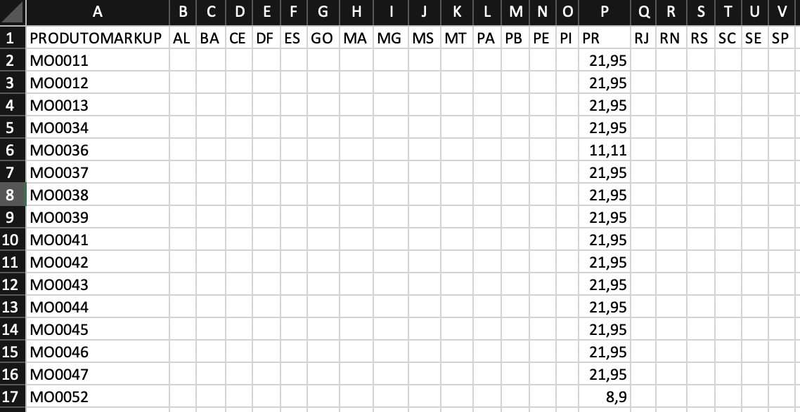

# Importação MKP - Preços SK

Fonte: BRWPBV.PRW

Autor: Jonathan Torioni

----

Esta rotina foi desenvolvida com o objetivo de facilitar uma importação de cadastros de Markup de produtos por UF, já efetuando o reprocessamento dos preços do produto.

Sua utilização é feita de forma manual, acessando a rotina de **Preços SK > Outras Ações > Imp.CV/Markup**

----

## Layout Importação

Essa rotina pode importar tanto CV quanto Markup, para que a importação do Markup seja identificada pelo programa, é necessário que o layout do arquivo atenda alguns requisito.

Layout para alteração de MARKUP deve conter a primeira coluna 'ProdutoMarkup' e as demais com a sigla de cada UF a ter o Markup ajustado.

Exemplo:

O arquivo deve estar obrigatoriamente em formato CSV

----

## Processamento

Após atender os requisitos informado no tópico anterior, o sistema irá solicitar a importação do arquivo, mediante ao processamento, o sitema irá retornar uma mensagem que os markups foram importados e processados.

Após essa mensagem o sistema irá abrir uma planilha de excel na maquina do usuário, nesta planilha fica identificados os preços antes e depois de processar, o markup antigo e o novo importado.

----

### [Download layout exemplo](../../../assets/MKP_MAXON_PR4.zip)