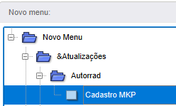
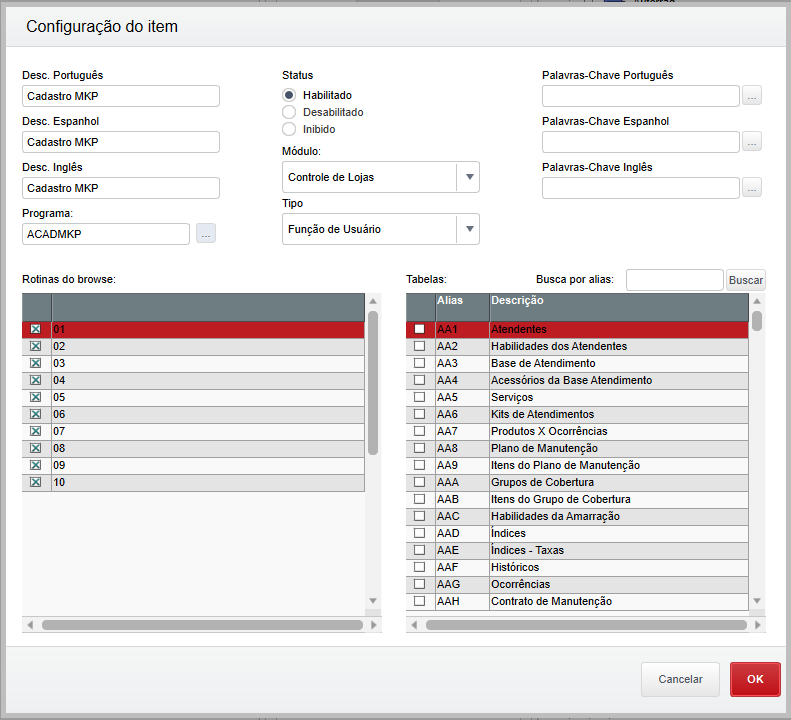
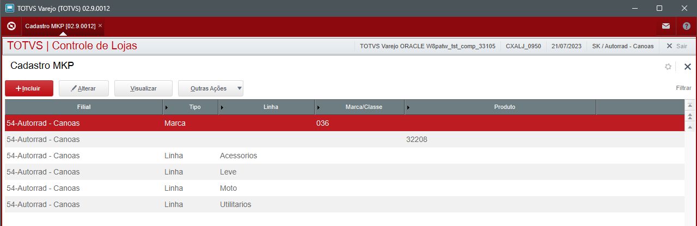
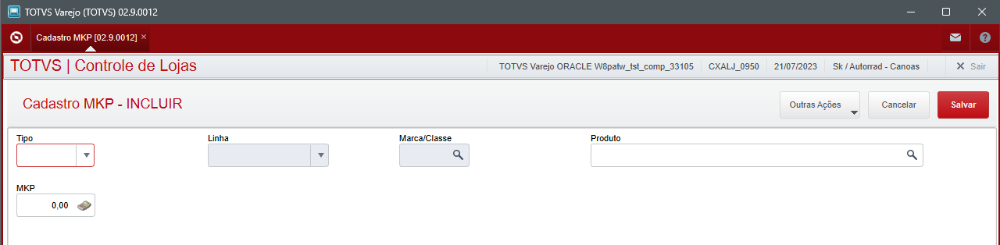

# Cadastro de MKP

**Cadastro de MKP - Autorrad**

----

## Dados da Customização

Analista: Jonathan Torioni
Data: 03/07/2023

----

## Objetivo da customização

Ter uma tela de cadastro de MKP de segurança por linha/marca, onde
somente a gestão geral da Autorrad ou T.I/Digital poderá ter acesso para alteração, uma
vez cadastrada.

Ter uma tela de inserção de MKP de produtos, com a possibilidade de
inserção em lote. Não sendo possível um MKP menor que o de segurança da
marca/linha

----

## Especificação de tabelas

Alias|Campo|Tipo|Tamanho|Decimal|Mascara|Nome|Descrição
---|----------|-|---|-|---------------------------------------------|------------|--------------------
PD9|PD9_FILIAL|C|2  | |@!                                           |FILIAL      |FILIAL
PD9|PD9_TIPO  |C|1  | |@!                                           |TIPO        |TIPO
PD9|PD9_LINHA |C|1  | |@!                                           |LINHA       |LINHA
PD9|PD9_MARCA |C|3  | |@!                                           |MARCA/CLASSE|MARCA/CLASSE
PD9|PD9_COD   |C|27 | |@!                                           |PRODUTO     |PRODUTO
PD9|PD9_MKP   |N|6  |3|@!                                           |MKP         |MKP

----

## Especificação de INDICE

INDICE|ORDEM|CHAVE|DESC
---|-|----------|-
PD9|1|PD9_FILIAL+PD9_LINHA|Filial+Linha
PD9|2|PD9_FILIAL+PD9_MARCA|Filial+Marca
PD9|3|PD9_FILIAL+PD9_TIPO |Filial+Tipo
PD9|4|PD9_FILIAL+PD9_COD  |Filial+Cod

----

## Especificação de funções

**U_ACADMKP** - Cadastro (AxCadastro) responsavel para a formacao de precos da SK - Autorrad

**U_AMKPOK** - Funcao responsavel por aprovar o cadastro da axcadastro

**U_MKPRSEG** - Funcao responsavel por retornar o mkp de segurança

**U_MKPMKP** - Funcao responsavel por retornar o MKP do produto

**U_MKPIMP** - Funcao responsavel por fazer a importacao em lote a partir de um modelo csv

----

## Especificação de MENU

O cadastro da rotina deve ser realizado no menu de controle de lojas (SIGALOJA)

----

## Funcionamento da Rotina

Ao acessar a rotina via menu: **Atualizações > Autorrad > Cadastro MKP** a seguinte tela será apresentada:

Clique em Incluir para acessar a tela de inclusão do MKP:

Nesta tela, existem alguns tipos de cadastros, as regras de MKP por Tipo: **Marca e Linha** ou cadastrar o MKP específico por **Produto**.

Para realizar o cadastro específico por produto, basta deixar o campo **Tipo** em branco e somente os campos de código de produto e MKP serão liberados.

Para cadastrar um registro específico por **Marca** basta preencher o campo **Tipo** com o M-Marca e somente os campos de **Marca/Classe** e **MKP** serão liberados para o cadastro.

Para cadastrar um registro específico por **Linha** basta preencher o campo **Tipo** com L-Linha e somente os campos de **Linha** e **MKP** serão liberados para o cadastro.

MKP por Marca/Classe ou Linha, são considerados como MKP de segurança. Ao tentar cadastrar um MKP de produto menor que o MKP de segurança, o sistema impedirá de concluir o cadastro.

:::info
**Caso haja um cadastro por marca/linha, e posteriormente seja feito um cadastro específico de um produto que é de uma determinada marca/linha já cadastrados anteriormente, o MKP não poderá ser menor que o MKP Geral.    
Isto foi pré-estabelecido pela gerencia da filial Autorrad.
**
:::

----

## Downloads

[Download diconário tabela PD9](../../../assets/Dicionario_PD9.zip)