# Venda Assistida

**Venda Assistida - Loja701**

----

## Dados da Customização

Analista: Jonathan Torioni
Data: 03/07/2023

----

## Objetivo da customização

Ter uma tela de onde os vendedores do balcão possam orçar as peças para os clientes e posteriormente fechar a venda, encaminhando o orçamento para o PDV, ou apenas fazer a cotação dos produtos.

Ter uma tela de pesquisa de produtos inteligente, onde os atendentes possam localizar as peças com maior facilidade, permitindo buscar os produtos não somente pelo código, mas pela caracteristicas de produto, nomes de veículos entre outras caracteristicas.

----

## Funcionamento da Rotina

Acesse a rotina através do menu: **Atualizações > Atendimento > Venda Assistida**

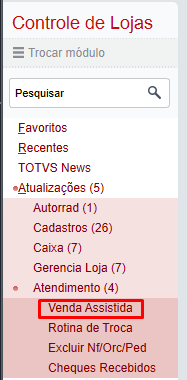

:::info
**Essa rotina deve ser acessada por um usuário cadastrado como caixa!**
:::

Tela inicial:

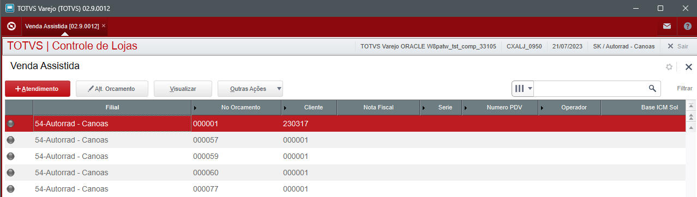

Para inicial o atendimento, clique em **+Atendimento**

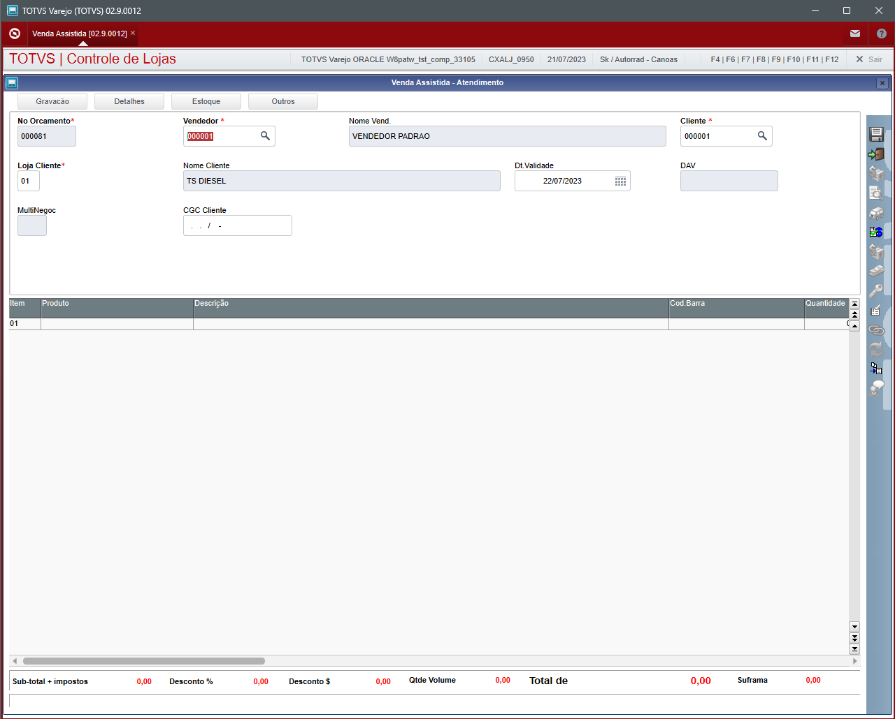

O Campo **Vendedor, deve inicialmente estar vinculado ao usuário caixa que está realizando o atendimento**, este pré-cadastro é de suma importância, pois ao iniciar o atendimento, o vendedor que aparecerá preenchido na tela do atendimento será referente ao cadastro do atendente.

Também é de suma importancia que exista um cadastro de cliente genérico, para que o atendimento sempre inicie com o campo cliente padrão. Isso vai garantir que todos os atendimentos possam ser realizados sem que seja necessário efetivamente cadastrar o cliente.

:::info
**Caso o cliente já possua cadastro no estabelecimento, preencha com o seu código e loja corretamente, isso irá garantir que o campor CGC Cliente seja preenchido de forma automática.**
:::

O campo **Dt. Validade** já inicia o atendimento com uma data pré-definida pela gerencia da filial, com a data atual mais um dia (24 horas). É importante respeitar este critério, pois o orçamento realizado deverá ter somente um dia de validade, após isso, deverá ser feito um novo orçamento para o cliente.

O campo **CGC Cliente** inicialmente ficará vazio caso o cadastro genérico de cliente esteja preenchido, isso é necessário para caso o cliente não queira se cadastrar, preencha somente o campo CGC Cliente para que posteriormente o orçamento possa ser localizado pelo CPF/CNPJ. Caso o campo CGC Cliente não seja preenchido, somente ficará disponível a pesquisa do orçamento mediante ao Numero do mesmo.

----

## Pesquisa de Produtos

Com o atendimento iniciado, na parte inferor da tela de atendimento se encontra o GRID de produtos.

Clique o campo **Produto** precione a tela F3 ou clique na lupa que aparecerá a diretia do campo. Após isso, será apresentada a tela de **Venda Assistida - Pesquisa Unificada de Produto**

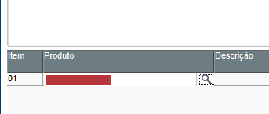

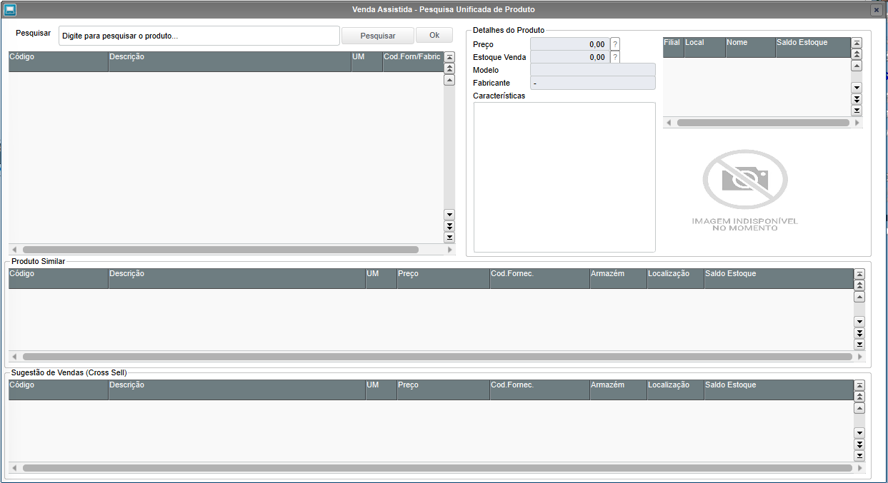

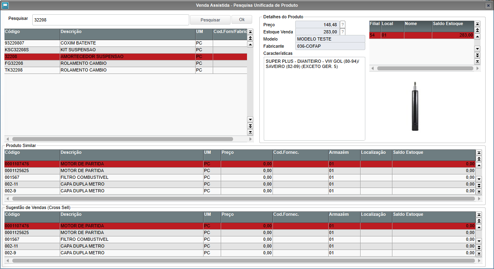

O campo pesquisa permite realizar pesquisa de várias formas, a forma apresentada na imagem acima é referente ao código do produto, porém a pesquisa pode ser feita através de caracteristicas, descrição e/ou qualquer outra informação que identifique o produto.

Ex: Na imagem abaixo, será buscado amortecedor para o Audi Q3:

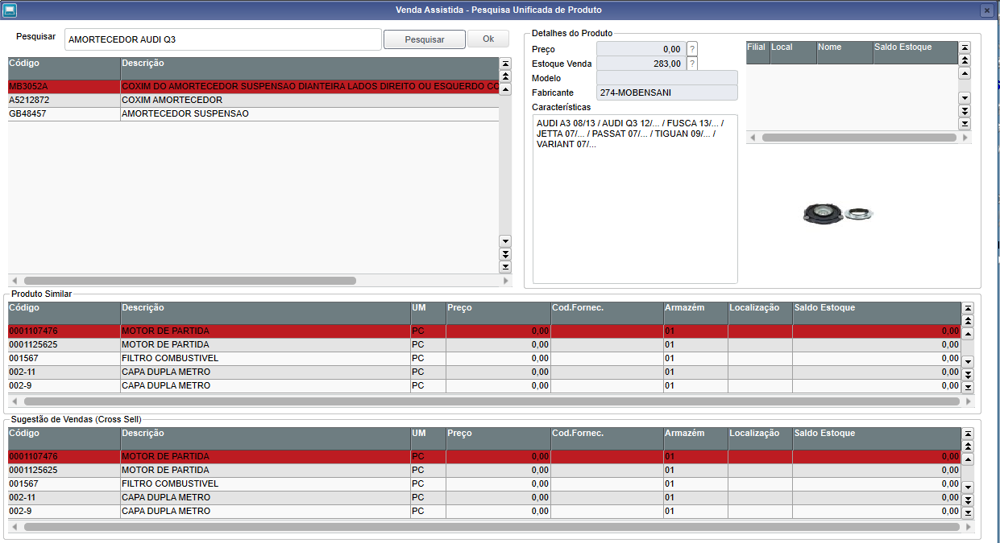

Veja, que a busca encontrou produtos similares com a pesquisa informada, porém essa pesquisa somente vai encontrar os produtos corretos caso o cadastro dos produtos sejam ricos em informações.

Para adiconar o produto pesquisado no orçamento, basta clicar duas vezes sobre o produto e será apresentado a seguinte tela:

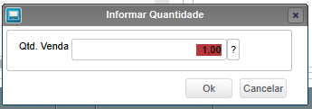

Informe a quantidade e clique em OK.

Após o atendimento ser concluido e o orçamento devidamente preenchido, basta clicar no icone do disquete, no lado superior direito da tela:

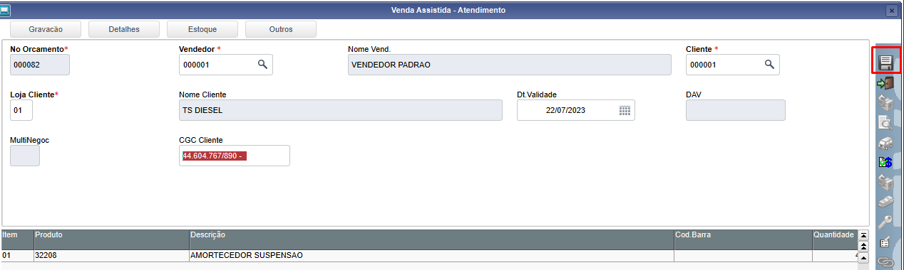

O orçamento ficará salvo na tela inical do venda assistida:

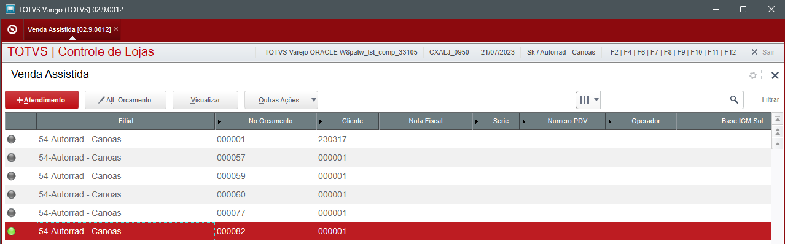

----

## Pesquisa do orçamento por CPF/CNPJ

Na tela do venda assistida, acesse a rotina: **Outras Ações > Pesq. CGC**

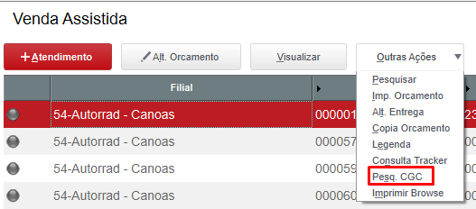

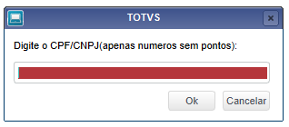

Informe o CGC somente os números para realizar a pesquisa, caso a pesquisa encontre o orçamento, será apresentada a seguinte mensagem:

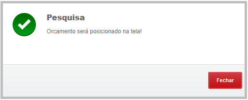

Após isso, o orçamento será posiconado na tela.

----

## Envio do orçamento por e-mail/impressão

Na tela do venda assistida, acesse a rotina: **Outras Ações > Imp. Orcamento**

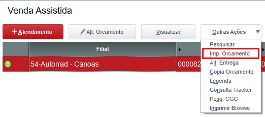

Após clicar na rotina, será apresenta a mensagem se deseja enviar o orçamento por e-mail:

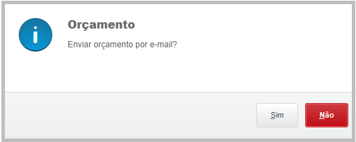

Clicando em **SIM**, será apresentada a tela para informar o e-mail do cliente:

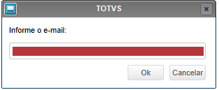

Após informar o e-mail, o orçamento será exibido em tela, para que possa realizar a impressão e o cliente já terá o e-mail com o orçamento:

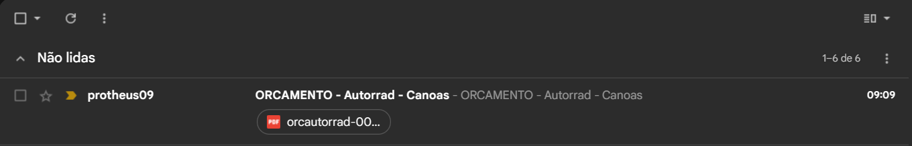

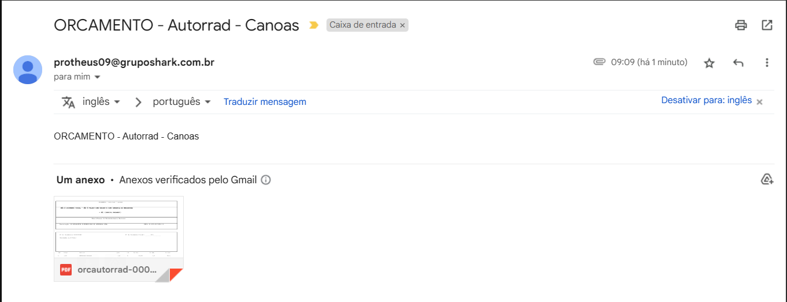

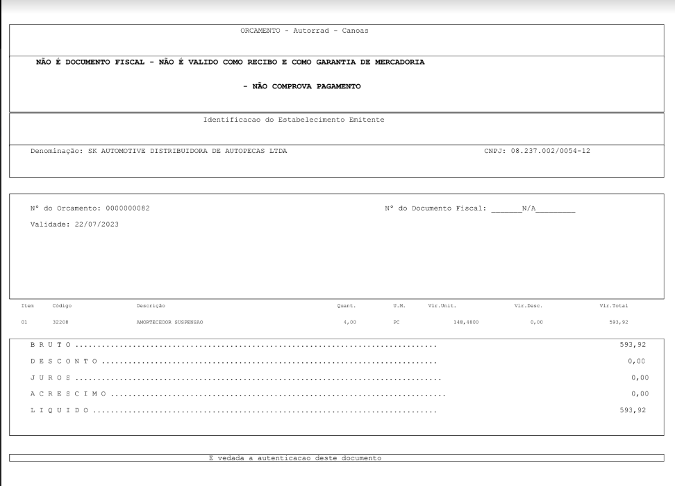

## Customizações de tabelas

Foi necessário customizar a SX3 referente as tabelas SLQ, SLR, SL1 e SL2

## Downloads

[Download diconário tabela SL1, SL2, SLQ, SLR](../../../assets/sx30901_venda_assistida.zip)
[Download diconário tabela SX7 LQ_CGC](../../../assets/sx70901_venda_assistida.zip)