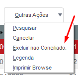
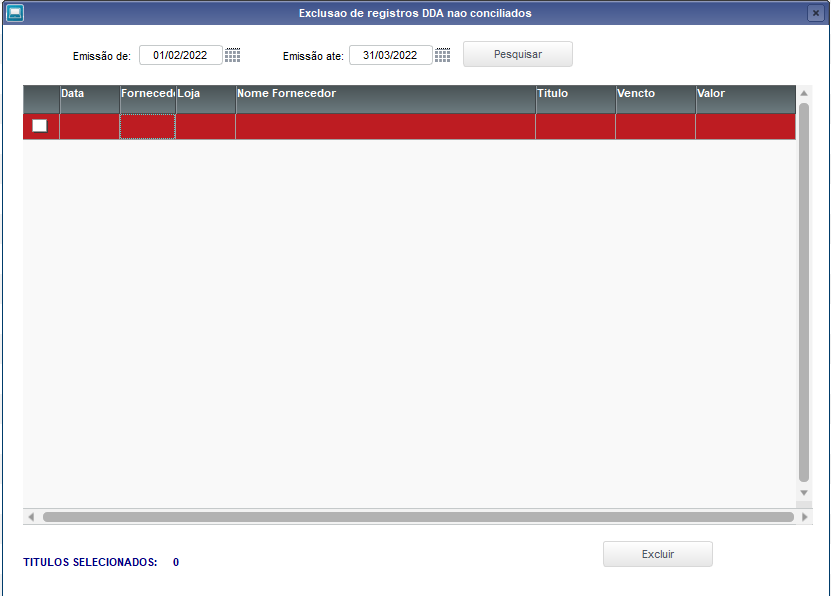
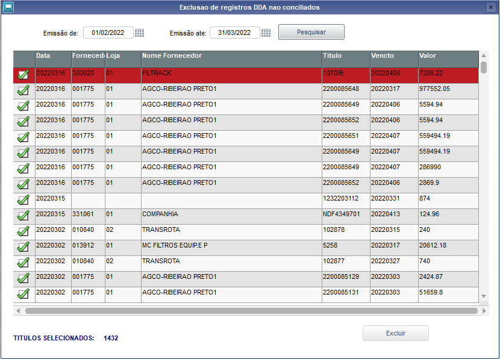
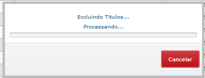
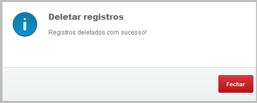

# Excluir Titulos DDA não conciliados

**Excluir titulos DDA antigos**

Módulo: 97 - Distribuição de Peças (SIGAESP)

----

## Dados da Customização

Analista: Carlos Henrique

----

## Especificação da customização

Criação de rotina para excluir os registros de titulos não conciliados. 

----

## Critérios da customização

- Somente registros de 365 dias antes da data atual.
- O periodo utilizado para a busca deve ser no maxámo de 365 dias.
- Liberação de acesso apenas para usuarios do financeiro Holding (Tabela:SZJ). 

----

## Processo

Rotina: **Concilicao DDA > Outras Ações**

Botão: Excluir nao conciliado.

Escolher a data de acordo com os critérios determidos

Pesquisar e selecionar os registros desejados

Ao clicar em excluir irá processar os registros

No final do processo retornará a mensagem de conclusão

