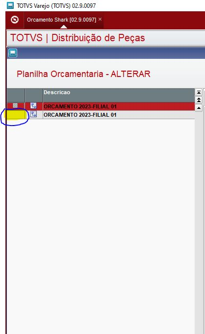
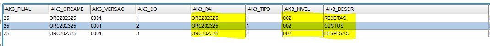
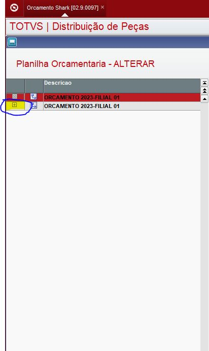

# PCO - Planilha orçamentaria

**Formação estrutura da planilha orçamentaria**

----
### Tadela

AK3

----

### Problema
Na planilha orçamentaria não aparece **"+"** com toda estrutura orçamentaria

----

### Solução
Verificar dois campos da tabela AK3, no campo AK3_PAI precisa estar preenchida com **"ORC+AAAA+FILIAL"** 

- **RECEITAS/CUSTOS/DESPESAS***
  **AK3_PAI***
  - ORC+AAAA+FILIAL = Exemplo(ORC202301)

e no campo AK3_NIVEL deve ser **"002"**
- **AK3_NIVEL***
  - 002

Após campos ajustados irá aparecer o **"+"** para ver e cadastrar dados na estrutura da planilha orçamentaria

