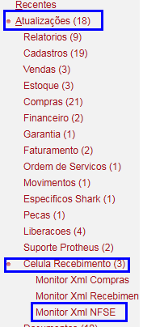
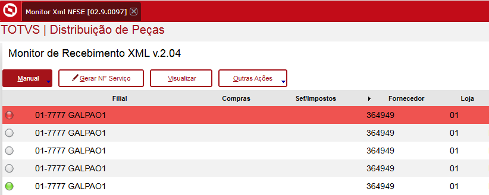
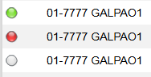
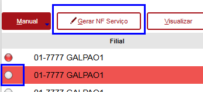
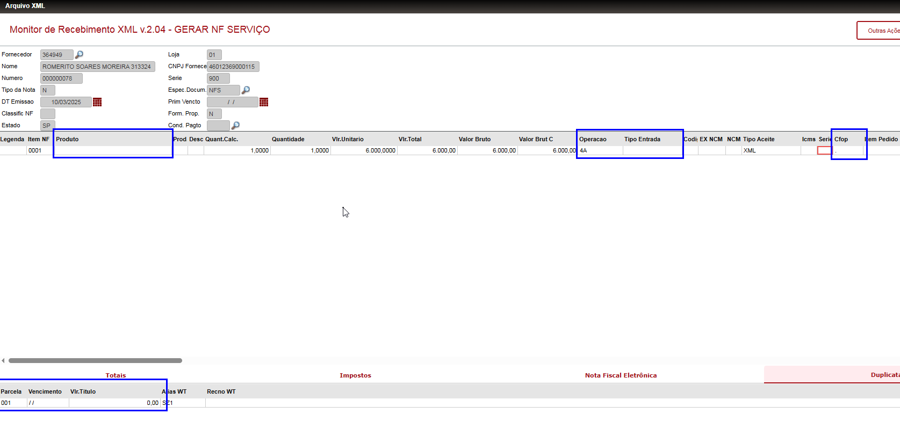
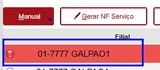

# Monitor xml NFSE

----

### Especificação

Receber Notas fiscais de serviço através do xml emitido pelo prestador de serviço

----

### Execução do Processo

**- Acesso a rotina**
Acessar Modulo Maquinas 97
Atualizações => Celula de Recebimento => Monitor xml NFSE

----

Após clicar na rotina vai abrir a tela com apenas Notas ficais de serviços 

----
**Legendas**

- **Branca =>** Significa que está apenas no monitor e pode ser preparada para o documento de entrada  
- **Vermelha =>** Significa que já foi recebida no monitor e está pronta para ser classificada no documento de entrada 
- **Verde =>** Significa que já foi classicada no documento de entrada 

----
**-Preprarando NFSE para classificar**

1. Posicione no xml com a legenda branca
2. Clique no botão **[Gerar NF Serviço]**
3. Preencha os campos que aparece na figura abaixo e clique em **[Salvar]**

----

Após salvar o documento vai ficar com a legenda vermelhar

----

Abra a rotina documento de entrada e faça o processo de classificar

