# Planilha Orcamentaria - Geração nova planilha

**Processo para gerar uma nova planilha orcamentaria do ano seguinte **

Módulo: 97 - Distribuição de Peças (SIGAESP)

----

## Dados da Customização

Analista: Carlos Henrique Mendes da Silva

----

## Especificação da customização

 Está rotina tem como objetivo criar uma nova planilha orcamentaria para o PCO copiando a estrutura e lançamentos anteriores, deixando zerados todos os periodos para facilitar a manutenção.

----

## Criação de rotina no Menu

Rotina: **Geração Planilha Orcamentaria**

1. Adicione a rotina no seu Menu: 

Acesse o ambiente (44) - Gestão de Prohetos > Atualizações > Acessos > Menus.

2. Busque o menu desejado e clique em OK

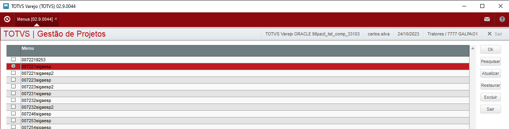

3. Posicione na linha do menu e adicione na coluna da direita utilizando o botão Adicionar >>. 

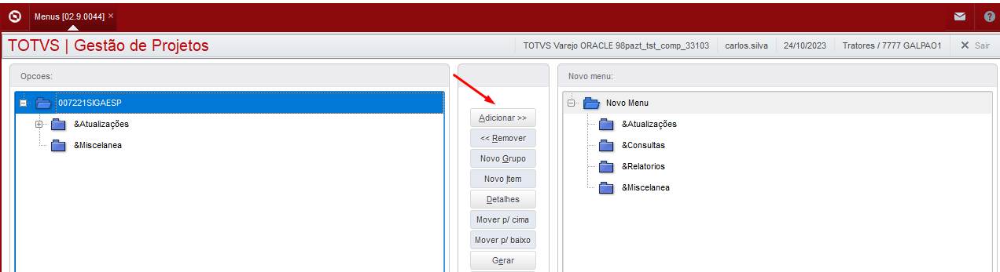

4. Posicione na linha da direita dentro do grupo desejado e clique em Novo Item

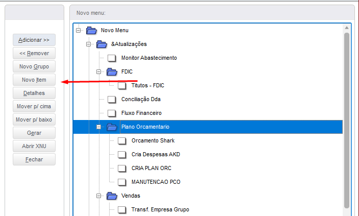

5. Preencha os campos com as seguintes informações e em seguda clique em OK.

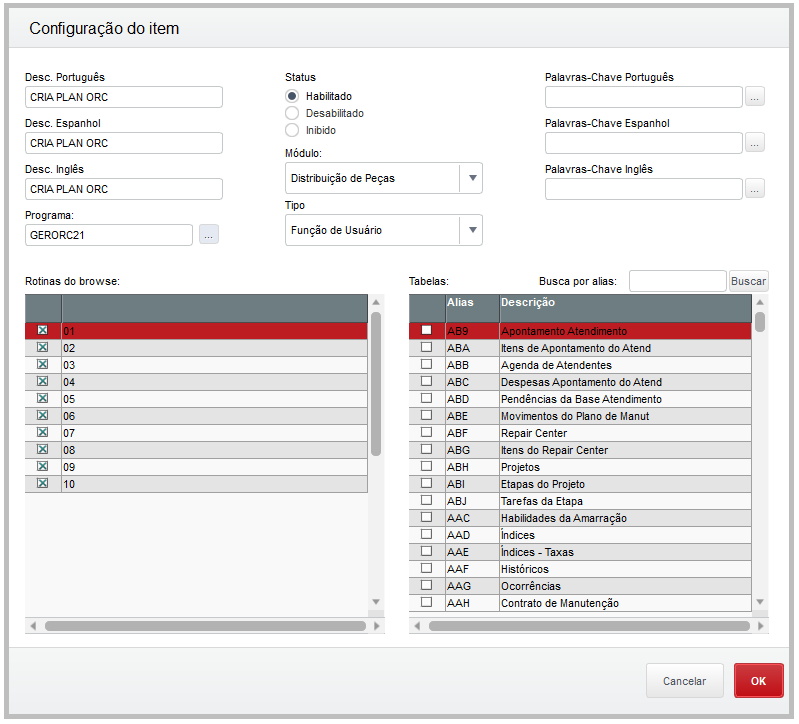

6. Clique em Gerar e digite o nome do menu e confirme todas as perguntas.

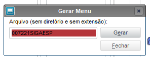

Relogue no sistema para disponibilizar a rotina no menu.

----

## Processo de criação da Planilha Orcamentaria

1. Acesse a rotina Orcamento Shark e verifique se a planilha do ano já ão foi criada.

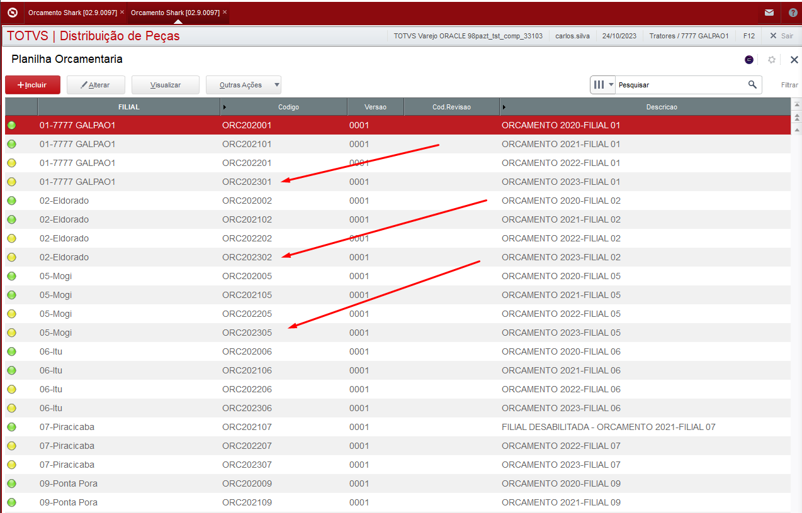

Para esta empresa ainda não foi criada para o ano de 2024.

2. Acesse a rotina GERORC21 criada no processo acima.

3. Informe o ano que será criado e clique em Ok

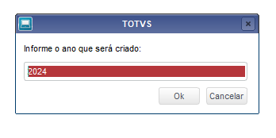

4. Informe se deseja criar de todas as filiais ou somente uma filial

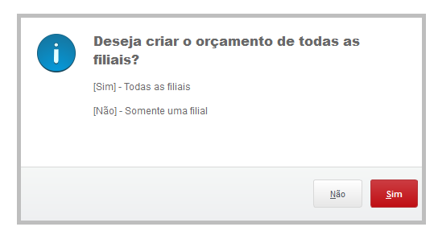

Se a resposta for Sim, será copiado todas as filiais do ano anterior 

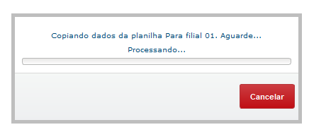
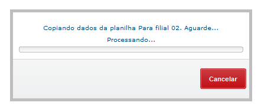
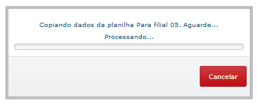

5. Ao final do processo será informado as filiais que foram processadas

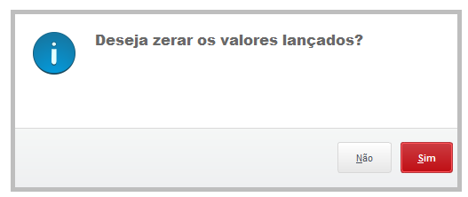

6. Caso deseja zerar os valores lançados, selecione a opção sim.

Essa rotina será disponibilizada apenas para o setor de T.i responsavel pelo PCO.

7. Confira se a planilha criada e confira os lançamentos

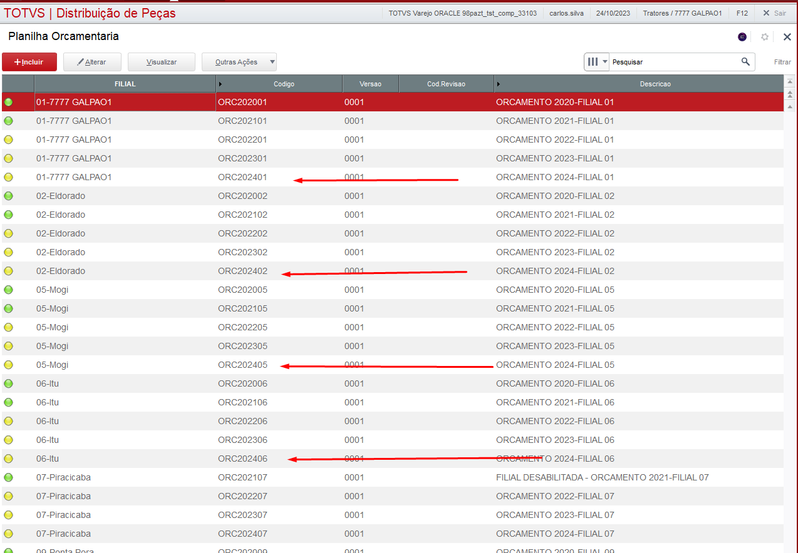
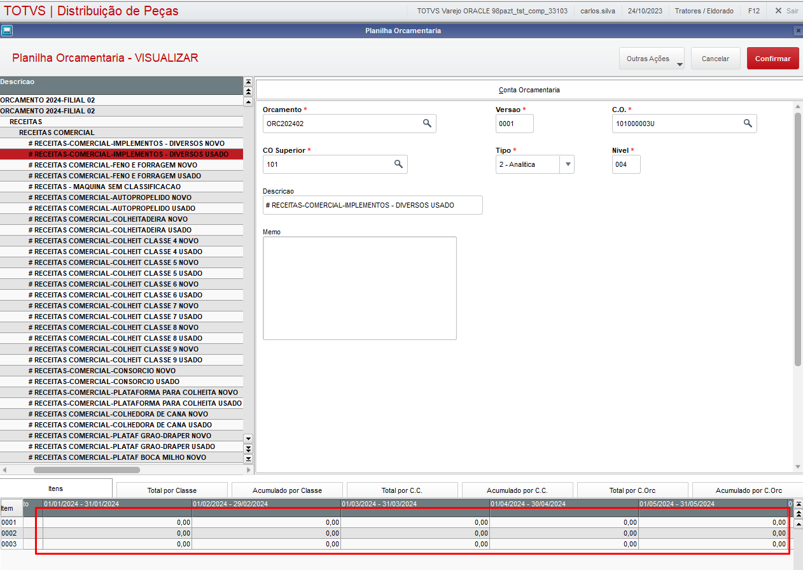

----

## Fontes 

- GERORC21.PRW

