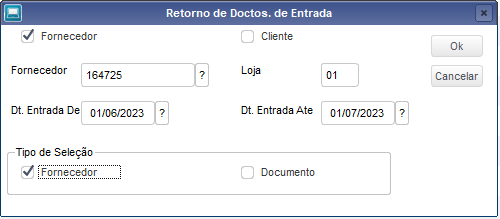
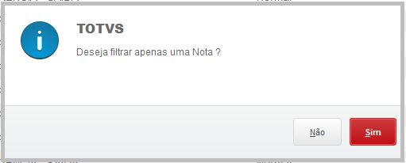
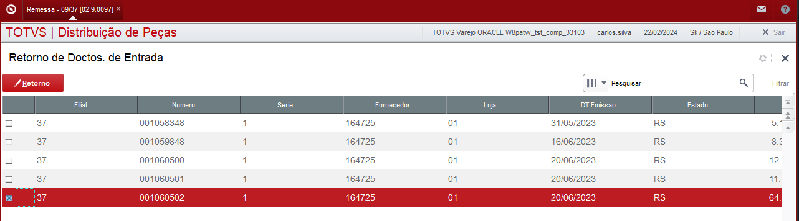
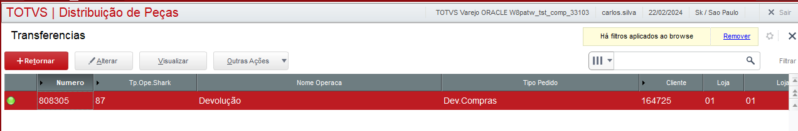

# Remessa - Retornar NF

Modulo: 97 - Distribuição de Peças (SIGAESP)

----

## Dados da Customização

Analista: Carlos Henrique Mendes da Silva

----

## Especificações da customização

 Está rotina tem como objetivo realizar o retorno de uma NF para o Cliente ou Fornecedor apartir de uma nota de origem.

----

## Processo

Rotina: **Remessa**

1. Acesse: 97 > Atualizações > Documento > Remessa.

2. Clique em Retornar e informe a filial correspondente.

3. Informe os parametros para localizar a nota de retorno e clique em Ok.

    

4. informe se deseja filtrar apenas uma nota. 

    

5. Selecione a nota que deseja retornar e clique em Retorno.

    

6. Informe os dados obrigatorios e clique em salvar.

    :::info
    Pedidos do tipo D - Devolução não caem na validação de limite de itens. 
    :::

7. Pedido gerado!

    

----
## Parametros
- ES_NBLQDEV

----

## Fontes 
- M410LIOK.PRW.PRW

