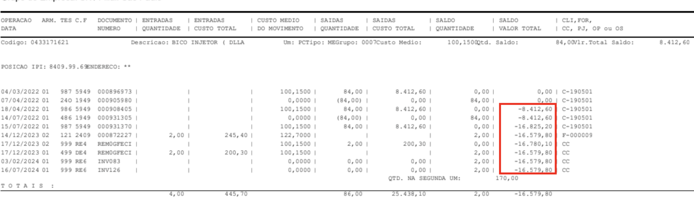
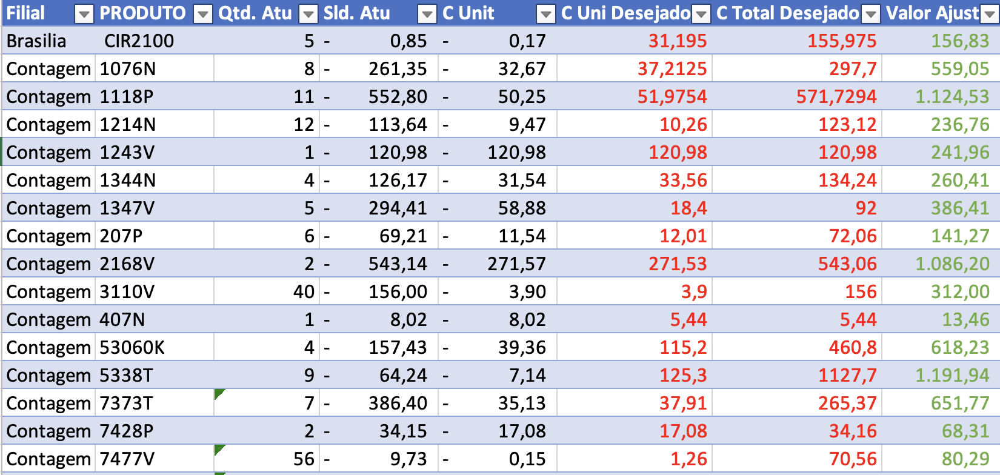
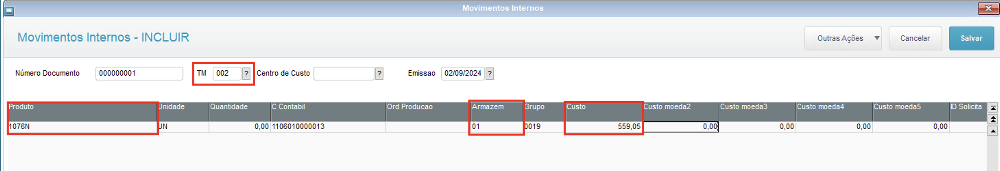

# Acerto de Custo Kardex

**Procedimento de ajusto de saldo no MATR900**

----

## Objetivo

Essa documentação foi desenvolvida com o intuito de registrar a causa do problema, a identificação e a resolução do mesmo.

----

**Analista**: Jonathan Torioni

----

## Saldo negativo ou errado no Kardex (MATR900)

Na imagem a baixo, vemos claramente o valor do estoque negativo, porém a quantidade no mesmo é positiva.

A identificação do problema nesse caso é bastante simples, como é possível de verificar no Kardex, o saldo do produto começou a ficar negativo, mesmo a quantidade em estoque sendo positiva.

Isso ocorre após o inicio da tentativa de devolução.

Em todos os casos analisados na empresa SK (170 produtos), todos os casos reportados, se tratavam do mesmo problema.

O Problema está específicamente no processo de Devolução da mercadoria ao fornecedor, e a recusa do mesmo. Sendo:

- É realizada a compra da mercadoria;
- Não queremos mais a mercadoria e emitimos uma nota de devolução ao fornecedor;
- O fornecedor recusa a mercadoria;
- Damos entrada novamente na mercadoria recusada.

Este processo em não deveria ocorrer com frequencia, porém é um ato corriqueiro dentro da SK.

O Saldo fica negativo, pelo fato de, devolvermos a mercadoria sem impostos, porém ao receber a recusa do fornecedor, estamos dando entrada novamente no estoque, so que contabilizando os impostos, isso eleva o custo da mercadoria.

Dessa forma, temos o cenário de devolver mais barato e "recomprar" mais caro.

Para resolver o problema em definitivo, é necessário que a equipe fiscal, analise esses cenários e ajustem as TES de saída de devolução e de entrada da recusa de devolução, ambas devem formar um par.

----

## Ajuste do custo

Para ajustar o custo, primeiro devemos identificar o ultimo custo médico correto.

O ultimo custo médio correto, normalmente é o ultimo registro do Kardex, antes das operações de devolução.

Para que fique simples e certeiro o ajuste do custo, vamos preencher uma planilha conforma o print abaixo:

Utilizando um dos exemplos da planilha, vemos que em contagem o produto **1076N** possui 8 quantidades em estoque, porém essas 8 unidades são representadas por um saldo negativo de **-261,35** ou seja, um custo unitário por produto de **-32,67**.

Para corrigir essa situação, devemos preencher ao lado, uma coluna, **Custo Unitário Desejado** ou seja, o custo médio que o produto deveria ter.

Ao preencher essa coluna, devemos criar uma formula para a coluna **Custo Total Desejado**, que é a representação do valor do estoque para as 8 peças.

Essa formula nada mais é que o **Custo Unitário Desejado** multiplicado por a **Quantidade Atual do Estoque**.

Por ultimo devemos preencher a coluna **Valor de Ajuste**, essa coluna é fundamental, pois é com o valor obtido nela, que vamos realizar o lançamento do acerto do custo.

Essa coluna é preenchida com a seguinte formula: **Custo total desejado - Saldo Atual** ou seja **297,7 - (-261,35)**

### Lançando no sistema o acerto de custo

Para lançar o custo, devemos entender que existem dois tipos de operações **ACERTO DE CUSTO + (002)** e **ACERTO DE CUSTO - (502)**, com isso entendido, devemos identificar qual operação iremos realizar. No caso do exemplo citado na iremos realizar o **ACERTO DE CUSTO +** onde estaremos valorizando a mercadoria no estoque.

Para realizar o lançamento do acerto de custo, acesse o módulo 04, **Atualizações > Movimentações > Internas > Movimentação Multipla**, clique em incluir, e selecione a filial na qual deverá ser realizado o lançamento.

Como pode ser observado na imagem acima, preencha o campo TM, com a operação de **ACERTO DE CUSTO +**, preencha o código do produto, o armazem onde deve ser corrigido o saldo e por fim, o valor do custo, este valor é obtido conforme explicado na documentação.

Após o devido preenchimento, clique em salvar.

Por fim, acesse a rotina de refaz saldos, preencha os campos produto de e até com o produto em questão, ao processar, selecione a filial correta.

----

## Informações importantes

O Saldo do produto somente será refletido no relatório de **Inventário P7** após o fechamento do estoque.

Após o ajuste, os movimentos já podem ser observados no Kardex Padrão.

