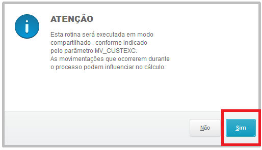
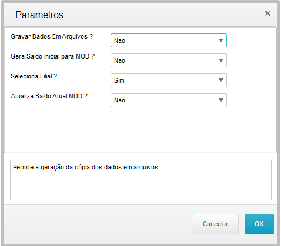
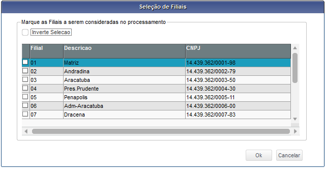
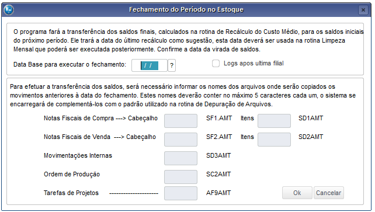
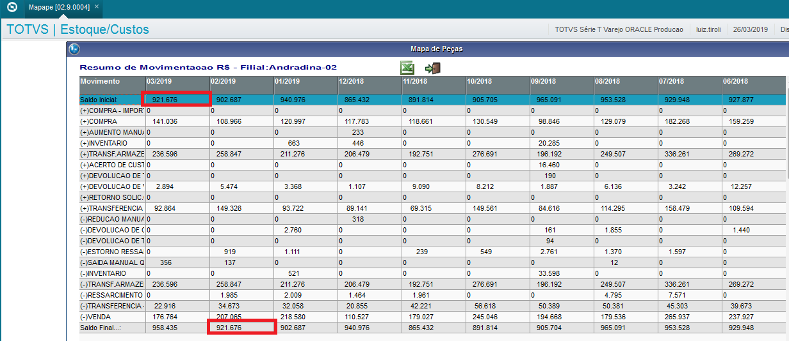
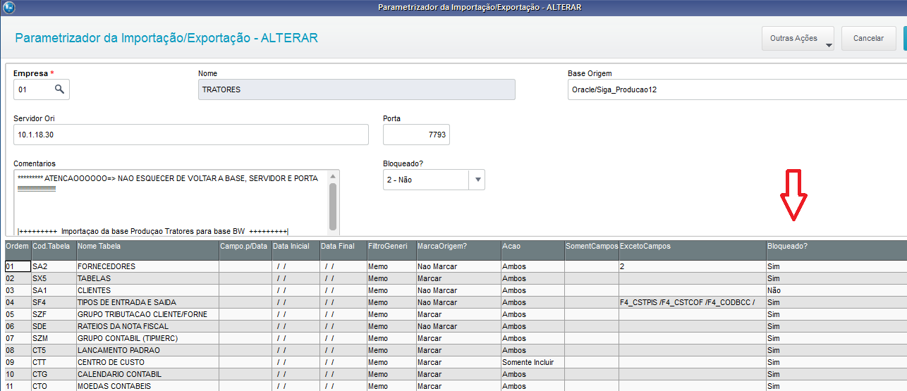
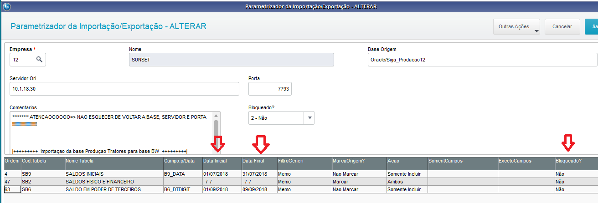
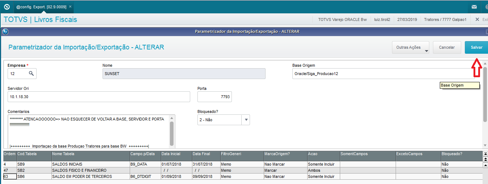
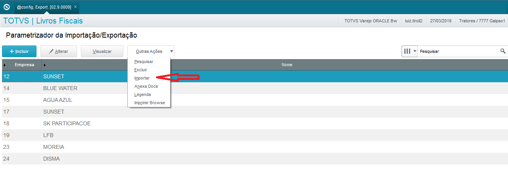

# Fechamento de estoque

**Fechamento mensal de estoque**

Módulo: 04 - Estoque Custos (SIGAEST)

----

## Recálculo do Custo Médio

Menu: **Miscelânia > Recálculo > Custo Médio**

Acesse a rotina de Custo Médio.

Informar os seguintes parâmetros:

* **Data Limite Final ?** → dd/mm/aa **( último dia do mês anterior )**
* **Mostra Lanctos. Contábeis ?** → Não
* **Aglutina Lanctos. Contábeis ?** → Sim
* **Atualizar Arq. de Movimentos ?** → Sim
* **% de Aumento da MOD ?** → 0
* **Centro de Custo ?** → Contábil
* **Conta Contábil a Inibir de ?** →
* **Conta Contábil a Inibir Até ?** → zzzzzzzzzzzzzzz
* **Apagar Estornos ?** → Sim
* **Gerar Lancto. Contábil ?** → Sim
* **Gerar Estrut.pela Moviment. ?** → Não
* **Contabilização On-Line Por ?** → Ambas
* **Calcula Mão-de-Obra ?** → Não
* **Método de Apropriação ?** → Mensal
* **Recalcula Níveis da Estrut. ?** → Não
* **Mostra Sequência do Cálculo ?** → Não Mostrar
* **Seq Processamento FIFO ?** → Custo Médio
* **Mov Internos Valorizados ?** → Antes
* **Recalcula custos Transportes ?** → Sim
* **Cálculo de custos por ?** → Filial Corrente
* **Calcular Custo em Partes ?** -> Não

Está rotina deve ser executada filial por filial podendo serem abertas várias filiais simultaneamente em threads distintas.
Não aconselho executar numa única thread o recálculo de todas filiais.

----

## Virada de Saldos

Menu: **Atualizações > Fechamento > Virada de Saldos**

Acesse a rotina e preencha as perguntas da seguinte forma:

**A data base do fechamento deve ser o último dia do mês anterior.**

----

## Mapa de Peça

Programa: **MAPAPE.PRW**

A cada virada de saldos é feita a checagem do saldo inicial x saldo final do estoque.
Indicar a data base do dia do dia atual.

:::info
**Esse procedimento é facultativo, não faz parte do processo de fechamento, é apenas uma conferência**
:::

----

## Refaz Saldo

Menu: **Atualizações > Saldos > Refaz Saldos**

Acesse a rotina e preencha os parâmetros:

* **Do Armazém ?** →
* **Até o Armazém ?** → zz
* **Do Produto ?** →
* **Até o Produto ?** → zzzzzzzzzzzzzzzzzzzzzzzzzzz
* **Zera o saldo de produtos MOD ?** → Não
* **Zera o CM de produtos MOD ?** → Não
* **Travar Registros SB2 ?** → Não
* **Seleciona Filiais ?** → Não

:::caution
**Estes procedimentos acima devem ser feitos em todas Filiais / Empresas do grupo nas bases de PRODUÇÃO e PRODUÇÃO SK.**
:::

----

## Integração AG x BW

**SINCRONIZAÇÃO DO ESTOQUE COM A BASE BW**

Após os fechamentos dos estoques na base PRODUÇÃO, os mesmos devem ser integrados com a base BW empresa por empresa.
São integradas as tabelas SB2, SB6 e SB9.

Essa sincronização é feita por empresa, sempre que é concluído o fechamento na base produção o mesmo deve ser integrado com a base BW.

----

### Parametrizar a import/export dos dados

Acesse a base BW

Modulo: **09 - Livros Fiscais (SIGAFIS)**   
Menu: **Atualizações > Específico Shark > @Config.Export**  
Programa: **SFISA01.PRW**

1. Bloquear a execução de todas as tabelas com “Sim” na coluna indicada conforme figura abaixo:

2.  Posicionar nas tabelas conforme figura abaixo e informar o período a ser importado nas tabelas SB6 e SB9, e setar a coluna “Bloqueado ?” para Não nas 3 tabelas:

3. Salvar alterações:

----

### Importação

Modulo: **09 - Livros Fiscais (SIGAFIS)**   
Menu: **Atualizações > Específico Shark > @Config.Export**  
Programa: **SFISA01.PRW**

Executar a importação

:::info
**Ao terminar a importação, todos os dados gerados pelo fechamento na base Agricolas também estarão na base BW.**
:::