# Formação de preço SK

**Processo de nova formação de preço de venda SK / Ecommerce**

### Dados da customização

Analista responsável: Jonathan Torioni

----

### Especificação da customização

Para que a plataforma de ecommerce possa praticar os preços que atualmente são utilizados nas lojas físicas, surgiu a necessidade de ajustar a formação de preços no pedido de vendas.

----

### Critérios da customização

**Formação de Preço de Venda**
* Lista de Preço por UF - Continua existindo e tendo como base o PBV
* Fator por segmento de cliente ATACADO ou VAREJO - continua existindo
* Fator Frete - **Desaparece**
* Fator Financeiro (boleto) - **Desaparece**
* Fator Cliente Especial - **Desaparece conforme parametro**
* Faixas de Preços (1-2-3-4-5-6) - **Desaparece, onde no sistema todas essas faixas de preços terão fator 1,00**
* Fator Prazo de Pagamento - **Continua existindo, porém com um novo cálculo para os fatores em cada prazo**

Conforme solicitado foram criados dois parâmetros para realizar o controle do calculo desconsiderando, Fator Frete, Fator Financeiro, Fator Cliente Especial e Faixas de Preços (1-2-3-4-5-6).

----

### Parâmetros

ES_FPRECVE – Define se as condições antigas na formação de pagamento serão utilizadas (Fator Frete, Fator Financeiro).

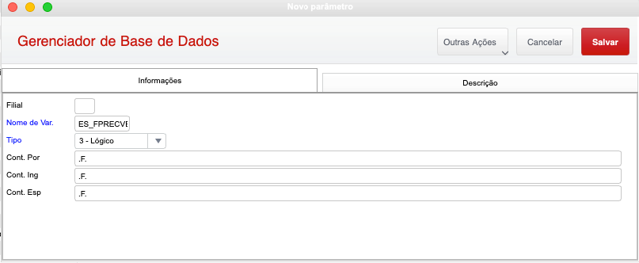
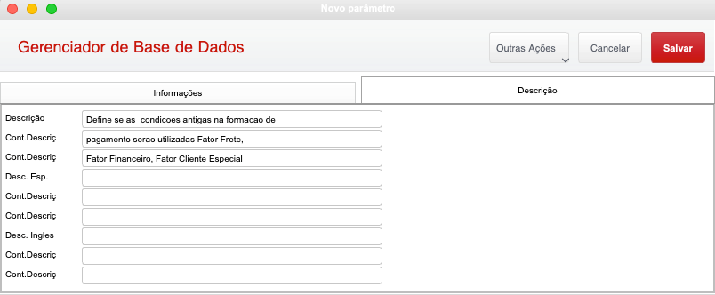

ES_FAIXAPR – Define se as faixas de preços 2 em diante serão utilizadas (Faixas de Preços (2-3-4-5-6))

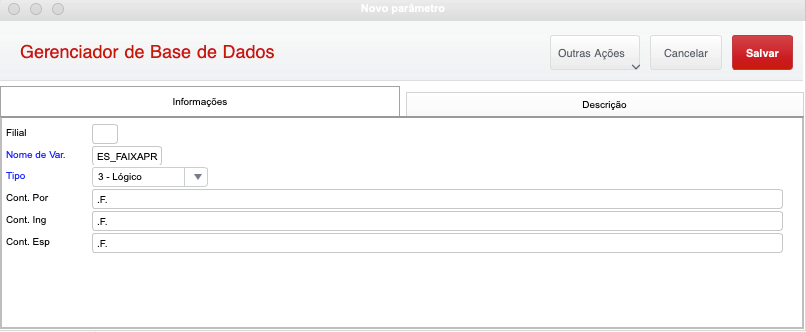
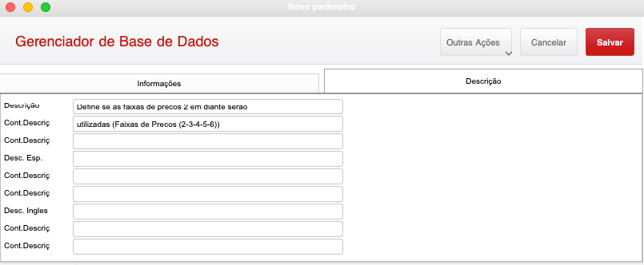

ES_PFX5 – Define a porcentagem para entrar na faixa 5

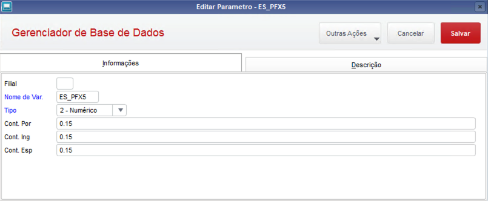
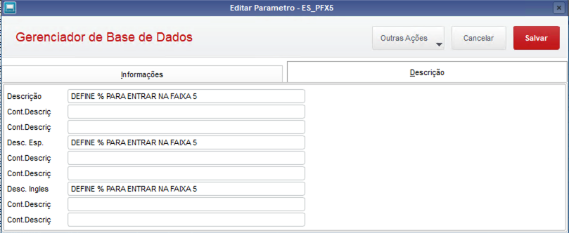

ES_PFX6 – Define a porcentagem para entrar na faixa 6
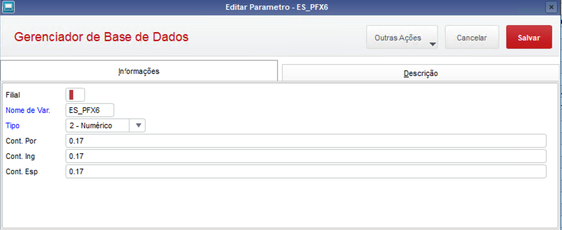
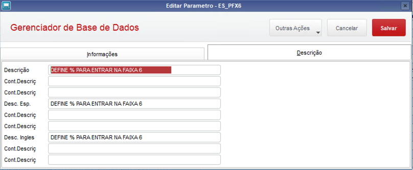

ES_ALTC6QT – Permite alteração do C6_PRCVEN ou CK_PRCVEN

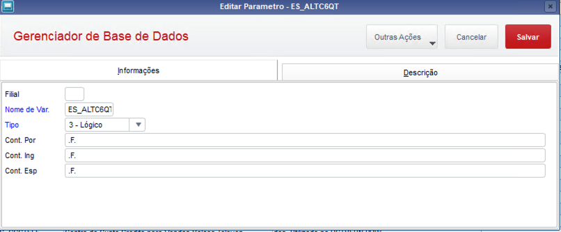
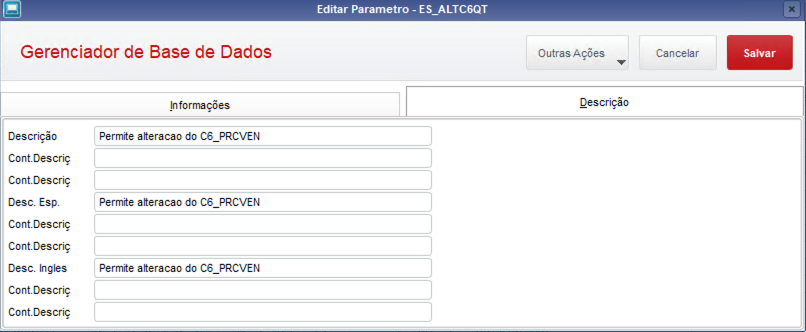

ES_UFNPRC – Define as UF’s que estão aptas para o novo modelo de precificação.

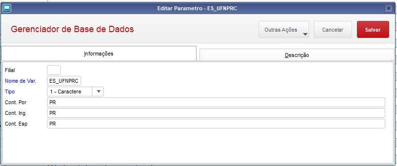
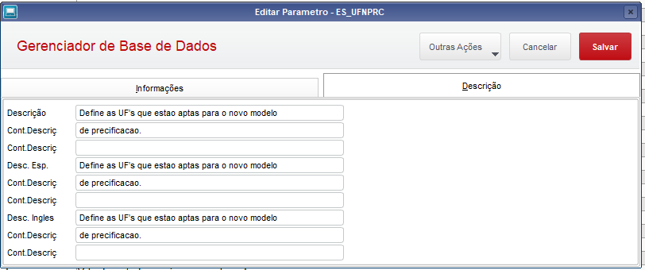

ES_CALESP - Define se o fator cliente especial será calculado.

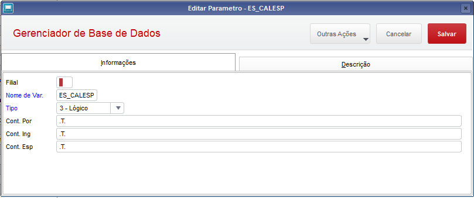
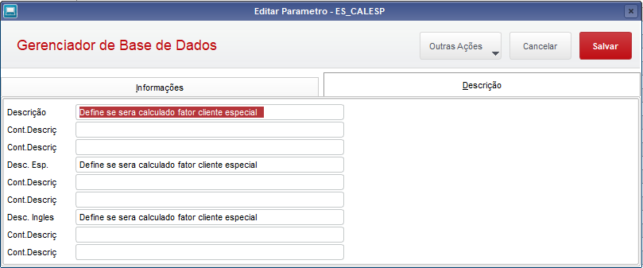

----

### Validação

PARAMETROS DESATIVANDO PARA CONDIÇÕES ANTIGAS (.F.)

1. Entrar no pedido de venda e clicar em incluir;
2. Digite o cabeçalho do pedido de vendas com os dados de um cliente ativo (156399/01);
3. Digite um produto válido e que tenha saldo em estoque (32208);
4. Ao digitar a quantidade ou o valor unitário, no combobox preço:, deve aparecer somente o **preço** 1.
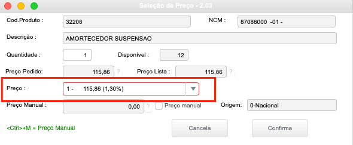

PARAMETROS ATIVADOS PARA CONDIÇÕES ANTIGAS (.T.)

5. Entrar no pedido de venda e clicar em incluir;
6. Digite o cabeçalho do pedido de vendas com os dados de um cliente ativo (156399/01);
7. Digite um produto válido e que tenha saldo em estoque (32208);
8. Ao digitar a quantidade ou o valor unitário, no combobox preço:, deve aparecer somente o **preço** 1.
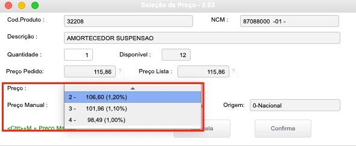

:::info
Obs: Fator Frete, Fator Financeiro, Fator Cliente Especial serão homologados pelos usuários antes de subir em produção.
Inicialmente o parâmetro ES_UFNPRC estará preenchida com PR, os testes devem comparar os valores praticados no estado de PR contra os outros estados e todas as modificações devem ter efeito somente nos estados contidos no parâmetro.

:::

----

### Fontes modificados

* specm010.prw
* totvsxfun.prw
* shmprecosk.prw