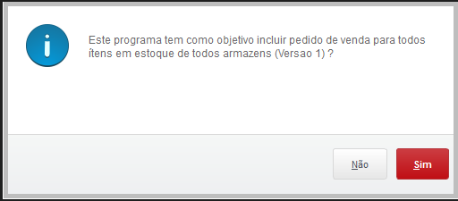
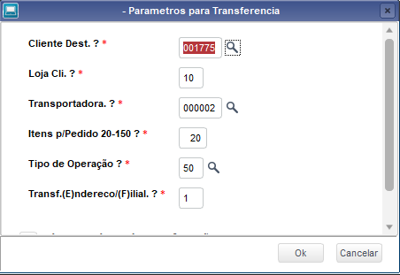
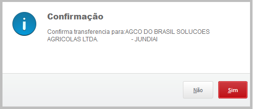
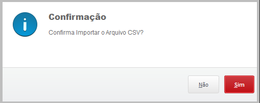
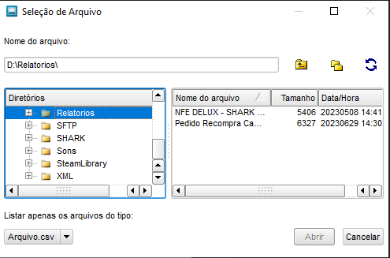
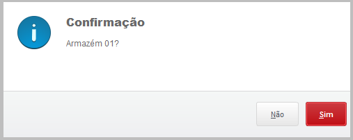
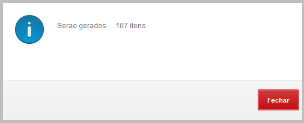
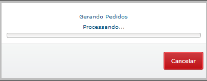
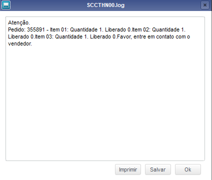
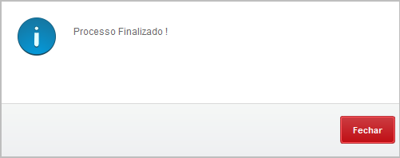

# Importação de Pedido Recompra

**Criação automatica de pedidos de recompra**

Módulo: 97 - Distribuição de Peças (SIGAESP)

----

## Dados da Customização

Analista: Carlos Henrique

----

## Especificação da customização

 Está rotina tem como objetivo criar pedido de vendas de recompra importando de um arquivo CSV.

----

## Processo

Rotina: **Pedidos Recompra**

Acesse a rotina Pedidos Recompra

1. Informativo do funcionamento da rotina

2. Confirma o inicio do processamento

3. Parametros de transferencia

4. Confirmação do Cliente utilizado

5. Confirma a importação por arquivo CSV.

6. Escolha do arquivo

7. Confirma armazém

8. Indica a quantidade de itens que será gerado

9. Gerando pedidos

10. Informações do pedido gerado

11. Processo finalizado

----

## Fontes 

- pedrecom.PRW

