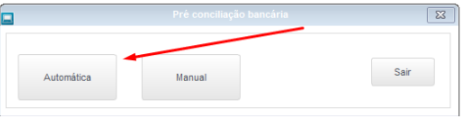
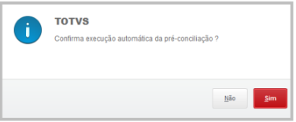
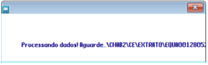
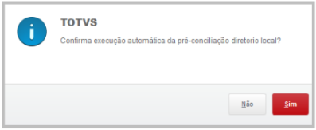
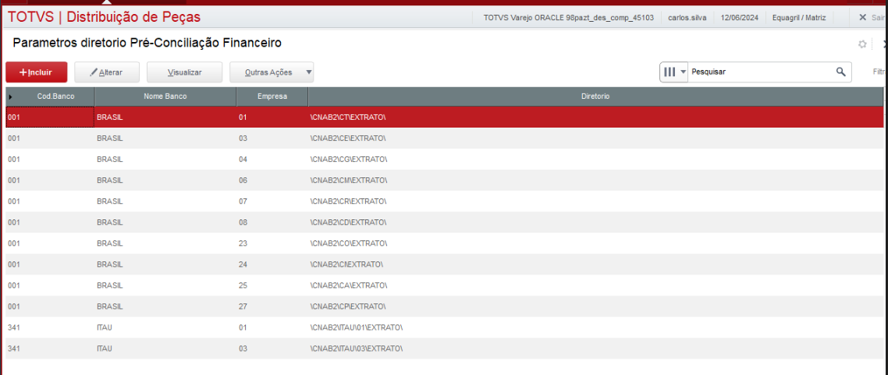

# Pré-Concicliação Automática 

**Automatizar a captura dos arquivos de pré conciliação bancaria**

Modulo: 06 - Financeiro  (SIGAFIN)

----

## Dados da Customização

Analista: Carlos Henrique 

----

## Especificação da customização

Tem como objetivo buscar todos os arquivos no diretorio SFTP Protheus, tirando a movimentação manual dos arquivos extratos bancarios.

----

## Critérios da customização

- Ativação do banco por parametro;
- Diretorio pré-definido cadastrado tabela PDA - Parametros diretorios financeiro

----

## Fontes e Parametros

- PRECONCILIACAO.VIEW.CLASS.PRW - Tela de processamento pré conciliação
- XSHPARFINA.PRW - Cadastro de diretorios 
- ES_AUTOPRE - Parametro contendo os bancos da pre conciliação, conteudo separado por ponto-virgula (;)

---

## Processo

Rotina: **Pre Conc. Bancaria**

                                                                            
1- Acesse a rotina de Pre Conciliação Bancaria e selecione a opção Automatica

2- A primeira janela é uma pergunta da pré-conciliação automatica pelo servidor. Se sim, irá processar todos os arquivos dos bancos ativos no parametro ES_AUTOPRE

Tela de processamento:

3-  Ao final do processo, se postivo, informe sim para apagar os arquivos processados.

4- Informe Sim na ultima opção caso deseje processar os arquivos do diretorio local.

Rotina de parametrização de diretorios extratos:

