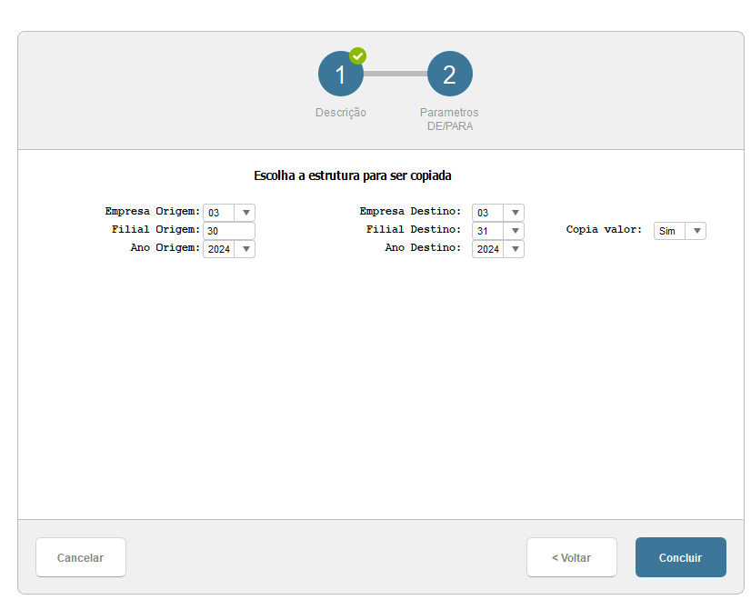
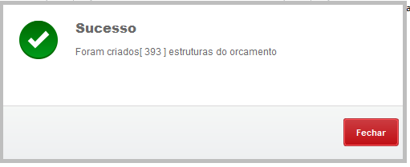
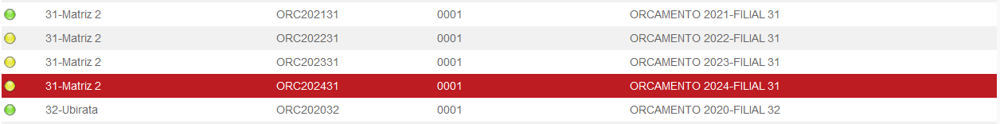
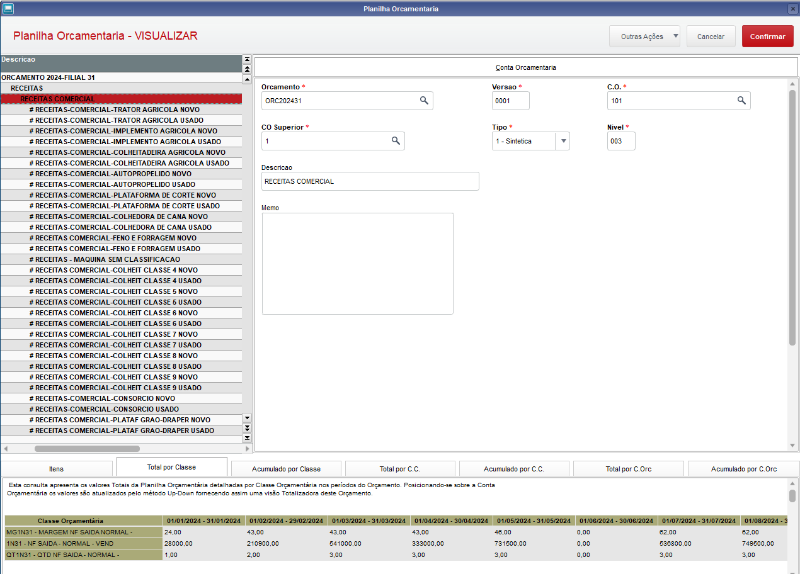

# Planilha Orcamentaria - Wizard Copia orcamento

**Rotina para copiar planilha financeira**

Modulo: 97 - Distribuição de Peças (SIGAESP)

----

## Dados da Customização

Analista: Carlos Henrique Mendes da Silva

----

## Especificações da customização

 Está rotina tem como objetivo buscar copiar a Estrutura e Lançamentos de uma planilha já lançada e criar uma nova para qualquer ano e filial dentro do grupo.

----

## Processo

Rotina: **Wizard - Copia Planilha Orcamentaria**

1. Acesse a rotina no seu menu e pule a descriação para a pagina de parametros.

2. Digite as informações necessarias para realizar a copia e clique em concluir.

- Empresa origem -> Codigo da empresa a ser copiada;
- Filial origem  -> Codigo da filial a ser copiada;
- Ano Origem     -> Ano a ser copiado;

- Empresa Destino -> Codigo da empresa irá receber os dados;
- Filial Destino  -> Codigo da filial irá receber os dados;
- Ano Destino     -> Ano que irá receber os dados;

- Copia valor     -> Informa se quer copiar os valores ou não.

 

3. Ao final de cada processamento irá informar uma mensagem de sucesso. 

4. Acesse a rotina Orcamento Shark para conferencia. 
Atualizações > Plano Orcamentario > Orcamento Shark 

 
 

----

----

## Fontes 

- XCOPYPCO.PRW

