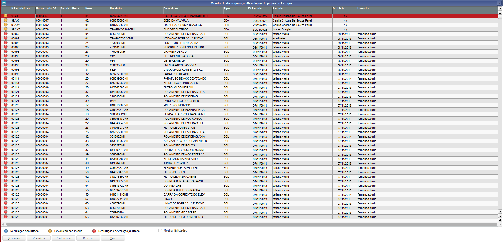
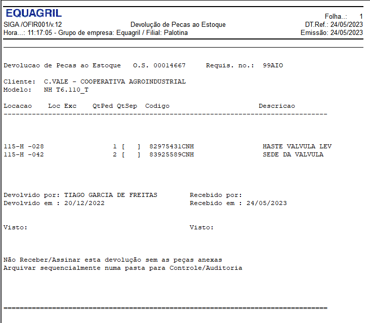
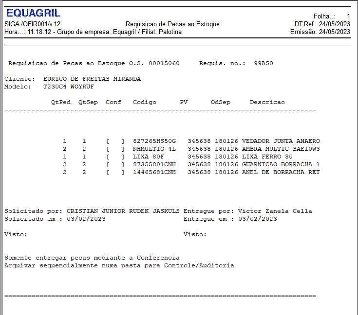

# Projeto Os - Ordem de Serviço

|**Homologação** ||
| :- | :- |
|**Protheus 2210** |**Projeto OS** **Solicitante: Mauricio Arcanjo** 
|**Criação** |**Criação 	24/05/2023 Versão 1.00 – Lucas Graglia Cardozo** |

----

## Objetivo

----

**O objetivo deste documento é validar e homologar o Relatório de Conferencia de
Requisições/Devoluções de Peças.**

----

## Gerar Relatório

1. Para geração do Relatório vamos acessar a rotina Lista de Requisição.    
**Modulo: 97 - Distribuição de Peças**
**Menu: Atualizações>Oficina>Lista de Requisição**

2. Após acessar a Lista de Requisição, vamos clicar no botão Conferencia. 

3. Ao clicar no botão “Conferencia” o relatório será impresso.

