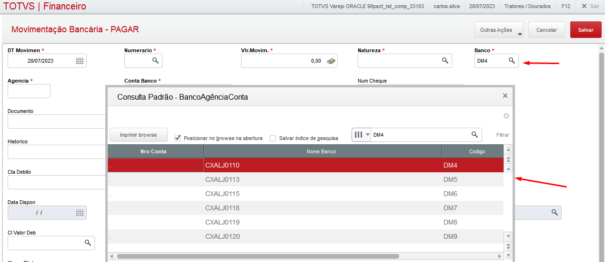
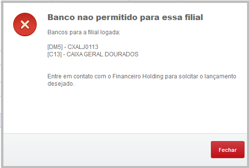
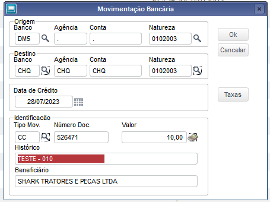
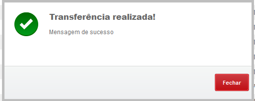

# Restrição Movimentação Bancária

**Limitar acesso das filiais na movimentação bancária**

Modulo: 06 - Financeiro (SIGAFIN)

----

## Dados da Customização

Analista: Carlos Henrique

----

## Especificaçãoo da customização

Solicitado pelo departamento financeiro holding a limitação do campo E5_BANCO para as demais filiais, limitando o seu acesso de acordo com as regras estabelecidas para garantir o funcionamente correto da rotina.

----

## Critérios da customização

- PAGAR, RECEBER: Somente é permitido **PAGAR** ou **RECEBER** pelo proprio banco da filial (E5_BANCO).

- Transferência entre C/C: 
1. Banco origem deve ser o da propria filial ou de acordo com as regras devinidas no paramêtro;
2. Banco destino não pode ser igual a origem e somente é permitido bancos determinados no paramêtro;
3. Tipo de movimentação deve ser igual ao estabelecido no paramêtro.

- Apenas usuários do financeiro holding cadastrados na tabela SZJ terão acesso total.

----

## Fontes e Parametros envolvidos 

- SHARKXFIN.PRW
- FA100TRF.PRW

---

## Processo

Rotina: **Movimentação Bancária**

Colocar no X3_VALID no campo E5_CAMPO =  ExistCpo("SA6",,,,,.F.) .AND. U_XVLDBCOF()                                                                                      

Botão: Pagar

1- Preencher no campo Banco*

:::info Se não for usuário filial,só será permitido selecionar o banco da propria filial

:::

2- Repita o processo no botão Receber

3-  Botão Transferência entre C/C 

Preencher os campos respeitando as seguintes regras

- Banco origem de ser a propria filial ou que contenha no parametro ES_TBCORIG.

- Banco destino não pode ser igual a origem e precisa conter dentro do parametro ES_TBCDEST.

- Tipo Mov deve conter no pamatro ES_TTPMOVI.

Os parametros serão controlados pelo cockpit do fincanceiro. Por padrão se não exister o parametro irá nascer com as informações DEFAULT:
	ES_TBCORIG = 
	ES_TBCDEST = CHQ|DEP|CAR|BCF| 
	ES_TTPMOVI = CC|CD|CH|R$|

Se todas as condições acima forem verdadeiras, irá apresentar a mensagem de sucesso.

Caso contrário irá apresentar a mensagem de erro.

