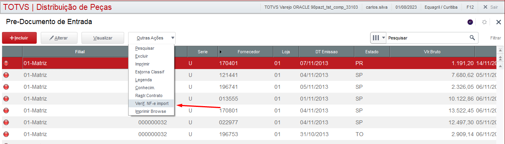
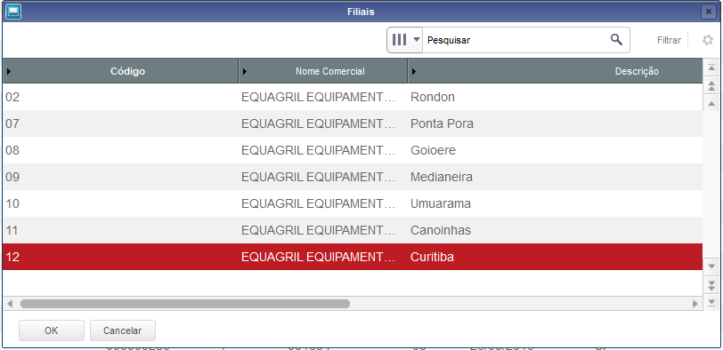
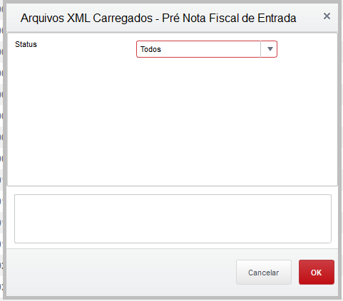
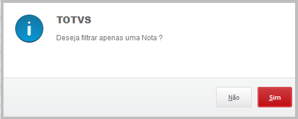
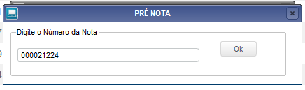
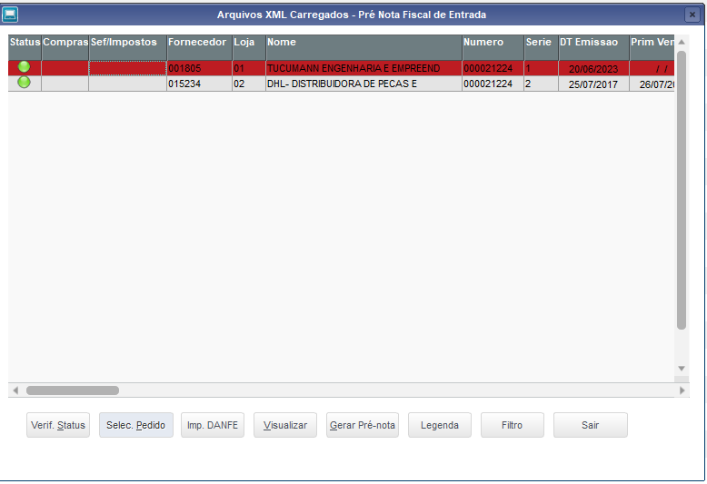
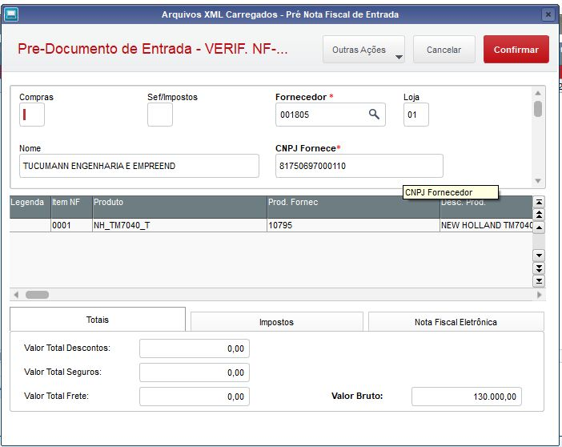
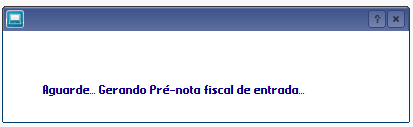
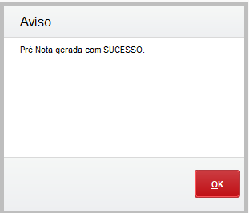
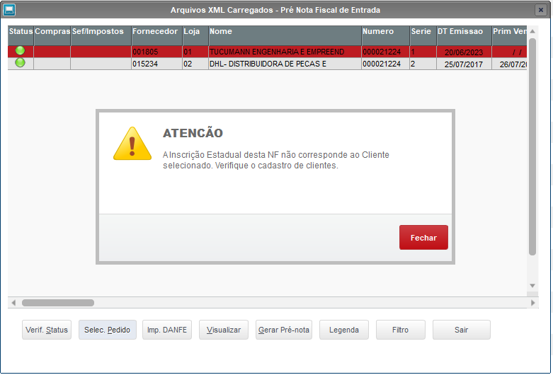

# Lançamento Pre Nota - Erro Chave UF

**Validar cadastro de cliente ou fornecedor na importação no lançamento Pre-Nota**

Modulo: 97 - Distribuição de Peças  (SIGAESP)

----

## Dados da Customização

Analista: Carlos Henrique

----

## Especificação da customização

Tem como objetivo fazer a mesma validação da função Relivadar do Monitor XML, assim corrigir o erro de chave UF não encontrada no lançamento de pré-nota.

----

## Critérios da customização

- Se a nota for do tipo B ou D = Benef./Devolucao, deve-se validar no cadastro de Clientes;
- Se a nota for do tipo N = Nota fiscal Normal, deve-se validar o cadastro de Fornecedores

----

## Fontes 

- MGERPRE01.PRW

---

## Processo

Rotina: **Pre Nota Entrada**

:::info 
A nota deve estar no monitor XML para a realização deste processo
:::                                                                                 
  

1- Outras Ações > Verif. NF e img/import*

2- Selecione a filial correspondente

3-  Selecione a opção desejada

4- Selecione para filtrar apenas uma nota

5- Pesquise a nota

6- Poscione na nota e clique em Gerar Pré Nota

O sistema irá trazer as informações referente a nota selecionada.

7- Confira os dados e clique em Confirmar

8- Aguarde o processamento

9- Se tudo estiver correto irá apresentar a mensagem de sucesso

Caso alguma informação esteja divergente 

