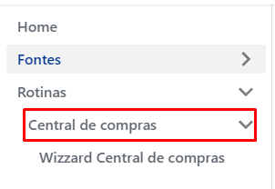
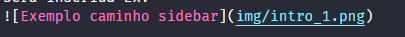

# Home

----

### Objetivo

Visando a melhoria continua do time, esta plataforma foi desenvolvida com o objetico de reunir em um só lugar as documentações internas, evitando disperdicio de tempo em procurar documentações enviadas em e-mails, Google Drive, etc.

Esta plataforma é um framework do facebook para documentações chamado [Docusaurus](https://docusaurus.io/), e o seu padrão de documentações são em [Markdown](https://pt.wikipedia.org/wiki/Markdown).

:::tip
Acesse: [Guia básico de Markdown](https://docs.pipz.com/central-de-ajuda/learning-center/guia-basico-de-markdown#open)
:::

----
### Como publicar minha documentação?

Encaminhe um e-mail para os responsáveis pelo ambiente, com o seu arquivo.md, e todas as imagens utilizadas dentro do arquivo.

Informe no corpo do e-mail qual será a o caminho da barra de menu em que a documentação será inserida Ex:  

:::info
Para cada documentação, crie um diretório com o nome da documentação ex: **primeirodoc**.

Dentro deste diretório, crie o **arquivo.md** e a pasta img caso possua imagens na documentação.
Na inserção das imagens das imagens garanta que o caminho esteja como **img/minhafoto.png**

**Exemplo**:  

Caso queria prefira hospedar suas imagens, recomendo a utilização da plataforma [**Imagekit.io**](https://imagekit.io/)
:::

----

### [Download Exemplos de documentações Markdown para o site](../assets/Exemplos_documentacoes_markdown.zip)